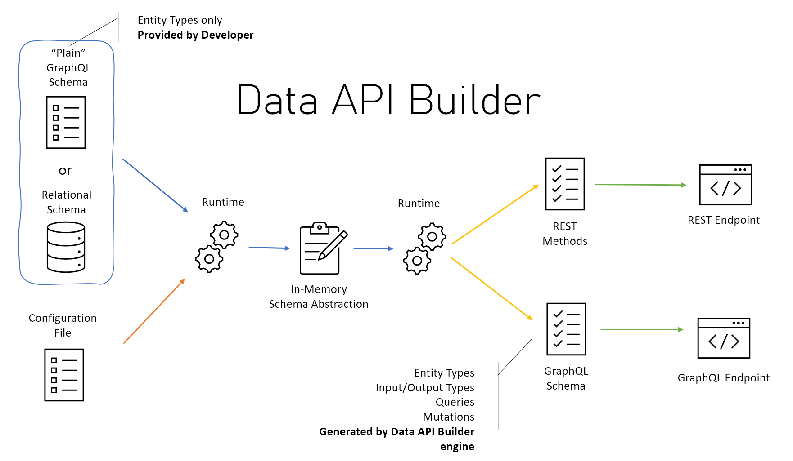

# Data API builder for Azure Databases

Latest stable version of Data API builder is **1.1.7** [What's new?](https://learn.microsoft.com/azure/data-api-builder/whats-new)

## Community

Join the Data API builder community! This sign up will help us maintain a list of interested developers to be part of our roadmap and to help us better understand the different ways DAB is being used. Sign up [here](https://forms.office.com/pages/responsepage.aspx?id=v4j5cvGGr0GRqy180BHbR1S1JdzGAxhDrefV-tBYtwZUNE1RWVo0SUVMTkRESUZLMVVOS0wwUFNVRy4u).

## About

**Data API builder for Azure Databases provides modern REST and GraphQL endpoints to your Azure Databases.**

With data API builder, database objects can be exposed via REST or GraphQL endpoints so that your data can be accessed using modern techniques on any platform, any language, and any device. With an integrated and flexible policy engine, native support for common behavior like pagination, filtering, projection and sorting, the creation of CRUD backend services can be done in minutes instead of hours or days, giving developers an efficiency boost like never seen before.

Data API builder is Open Source and works on any platform. It can be executed on-premises, in a container or as a Managed Service in Azure, via the new [Database Connection](https://learn.microsoft.com/azure/static-web-apps/database-overview) feature available in Azure Static Web Apps.

## Features

- Allow collections, tables, views and stored procedures to be accessed via REST and GraphQL
- Support authentication via OAuth2/JWT
- Support for EasyAuth when running in Azure
- Role-based authorization using received claims
- Item-level security via policy expressions
- REST
  - CRUD operations via POST, GET, PUT, PATCH, DELETE
  - Filtering, sorting and pagination
- GraphQL
  - Queries and mutations
  - Filtering, sorting and pagination
  - Relationship navigation
- Easy development via dedicated CLI
- Full integration with Static Web Apps via Database Connection feature when running in Azure
- Open Source

## Getting Started

To get started quickly with Data API builder for Azure Databases, you can use the [Getting Started](https://learn.microsoft.com/azure/data-api-builder/get-started/get-started-with-data-api-builder) tutorial, that will help to get familiar with some basic tools and concepts while giving you a good experience on how much Data API builder for Azure Databases can make you more efficient, but removing the need to write a lot of plumbing code.

## Documentation

Documentation is available [here](https://learn.microsoft.com/azure/data-api-builder/).

## Samples

Several samples are available already. To follow the [Getting Started](https://learn.microsoft.com/azure/data-api-builder/get-started/get-started-with-data-api-builder) tutorial you'll find the associated code in the [`samples`](https://github.com/Azure/data-api-builder/tree/main/samples) folder.

More samples, including end-to-end samples using the most common frontend frameworks, are available in the [https://github.com/Azure-Samples/data-api-builder](https://github.com/Azure-Samples/data-api-builder) repository

## Getting Started Videos

We've put together a playlist of short videos to help you get started with Data API builder and fullstack/jamstack development: https://www.youtube.com/playlist?list=PLYA3nHmjWIYE1PUl8_dVR-yKtCLgVhie4

## Known Issues

List of known issues and possible workarounds, where applicable and possible, is available here: [Known Issues](https://learn.microsoft.com/azure/data-api-builder/known-issues).

## Development Roadmap

Do you want to know what we're working on and what is the planned development roadmap for Data API builder? Or do you have some wonderful ideas on how to improve Data API builder and want to share them? Go here: [https://github.com/Azure/data-api-builder/discussions/1377](https://github.com/Azure/data-api-builder/discussions/1377).

## How to Contribute

Contributions to this project are more than welcome. Make sure you check out the following documents, to successfully contribute to the project:

- [Code Of Conduct](./CODE_OF_CONDUCT.md)
- [Security](./SECURITY.md)
- [Contributing](./CONTRIBUTING.md)

If you want to propose a completely new feature, please create an RFC item. Good examples of how to create RFC can be found here:

- [Rust RFC Template](https://github.com/rust-lang/rfcs/blob/master/0000-template.md)
- [Python PEP Guidance](https://www.python.org/dev/peps/pep-0001/#what-belongs-in-a-successful-pep)

## References

- [Microsoft REST API Guidelines](https://github.com/microsoft/api-guidelines/blob/vNext/Guidelines.md)
- [Microsoft Azure REST API Guidelines](https://github.com/microsoft/api-guidelines/blob/vNext/azure/Guidelines.md)
- [GraphQL](https://graphql.org/)

## License

**Data API builder for Azure Databases** is licensed under the MIT license. See the [LICENSE](./LICENSE.txt) file for more details.

## Third-Party Component Notice

If you use the third-party software Banana Cake Pop by ChilliCream, Inc., as part of your Data API builder solution, you may have the option to save your work on ChilliCream's cloud service, via your separate ChilliCream account.  Microsoft is not affiliated with and does not endorse ChilliCream's service, and you use those services at your own option.

## Trademarks

This project may contain trademarks or logos for projects, products, or services. Authorized use of Microsoft trademarks or logos is subject to and must follow Microsoft's Trademark & Brand Guidelines. Use of Microsoft trademarks or logos in modified versions of this project must not cause confusion or imply Microsoft sponsorship. Any use of third-party trademarks or logos are subject to those third-party's policies.
