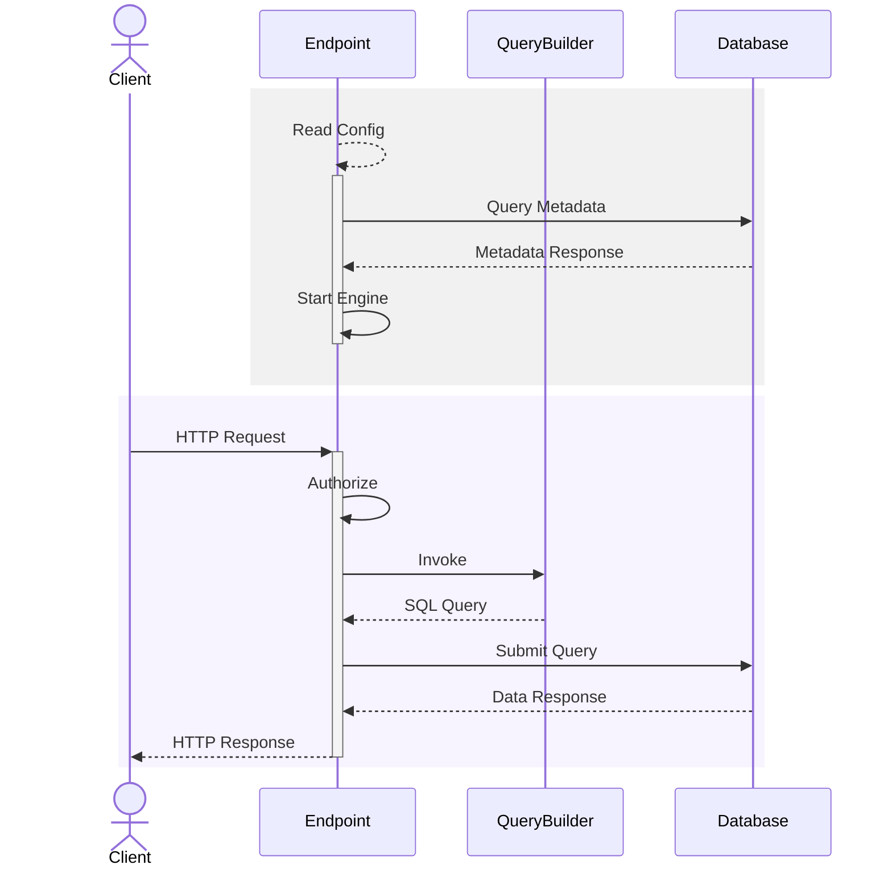

# Data API builder for Azure Databases

[](https://www.nuget.org/packages/Microsoft.DataApiBuilder)
[](https://www.nuget.org/packages/Microsoft.DataApiBuilder)
[](https://learn.microsoft.com/azure/data-api-builder/)
[](https://opensource.org/licenses/MIT)

[What's new?](https://learn.microsoft.com/azure/data-api-builder/whats-new)

## Join the community

Want to be part of our priorities and roadmap? Sign up [here](https://forms.office.com/pages/responsepage.aspx?id=v4j5cvGGr0GRqy180BHbR1S1JdzGAxhDrefV-tBYtwZUNE1RWVo0SUVMTkRESUZLMVVOS0wwUFNVRy4u).


## About Data API builder

Data API builder (DAB) is an open-source, no-code tool that creates secure, full-featured REST and GraphQL endpoints for your database. It’s a CRUD data API engine that runs in a container—on Azure, any other cloud, or on-premises. DAB is built for developers with integrated tooling, telemetry, and other productivity features.

> [!IMPORTANT]
> Data API builder (DAB) is open source and always free.

### Which databases does Data API builder support?

|               | Azure SQL | SQL Server | SQLDW | Cosmos DB | PostgreSQL | MySQL |
| :-----------: | :-------: | :--------: | :---: | :-------: | :--------: | :---: |
| **Supported** |    Yes    |     Yes    |  Yes  |    Yes    |     Yes    |  Yes  |

### Which environments does Data API builder support?

|               | On-Prem | Azure |  AWS |  GCP | Other |
| :-----------: | :-----: | :---: | :--: | :--: | :---: |
| **Supported** |   Yes   |  Yes  |  Yes |  Yes |  Yes  |

### Which endpoints does Data API builder support?

|               | REST | GraphQL |     MCP     |
| :-----------: | :--: | :-----: | :---------: |
| **Supported** |  Yes |   Yes   | Coming soon |

## Getting started

Use the [Getting Started](https://learn.microsoft.com/azure/data-api-builder/get-started/get-started-with-data-api-builder) tutorial to quickly explore the core tools and concepts.

### 1. Install the `dotnet` [command line](https://get.dot.net)

https://get.dot.net

> [!NOTE]
> You may already have .NET installed!

The Data API builder (DAB) command line requires the .NET runtime version 8 or later.

#### Validate your installation

```sh
dotnet --version
```

### 2. Install the `dab` command line

The Data API builder (DAB) command line is cross-platform and intended for local developer use.

```sh
dotnet tool install microsoft.dataapibuilder -g
```

#### Validate your installation

```sh
dab --version
```

### 3. Create your database (example: Azure SQL database / T-SQL)

This example uses a single table for simplicity.

```sql
CREATE TABLE dbo.Todo
(
    Id INT PRIMARY KEY IDENTITY,
    Title NVARCHAR(500) NOT NULL,
    IsCompleted BIT NOT NULL DEFAULT 0
);
INSERT dbo.Todo (Title, IsCompleted)
VALUES
    ('Walk the dog', 0),
    ('Feed the fish', 0),
    ('Clean the cat', 1);
```

### 4. Prepare your connection string

Data API builder (DAB) supports `.env` files for testing process-level environment variables.

#### PowerShell (Windows)

```ps
echo "my-connection-string=$env:database_connection_string" > .env
```

#### cmd.exe (Windows)

```cmd
echo my-connection-string=%database_connection_string% > .env
```

#### bash (macOS/Linux)

```bash
echo "my-connection-string=$database_connection_string" > .env
```

#### Resulting .env file

The file `.env` is automatically created through this process. These are the resulting contents:

```
"my-connection-string=$env:database_connection_string" 
```
> [!NOTE]
> Be sure and replace `database_connection_string` with your actual database connection string.

> [!IMPORTANT]
> Adding `.env` to your `.gitignore` file will help ensure your secrets are not added to source control. 

### 5. Create your initial configuration file

Data API builder (DAB) requires a JSON configuration file. Use `dab --help` for syntax options.

```sh
dab init
  --database-type mssql
  --connection-string "@env('my-connection-string')"
  --host-mode development
```

> [!NOTE]
> Including `--host-mode development` enables Swagger for REST and Nitro for GraphQL.

#### Resulting configuration

The file `dab-config.json` is automatically created through this process. These are the resulting contents:

```json
{
  "$schema": "https://github.com/Azure/data-api-builder/releases/download/v1.5.56/dab.draft.schema.json",
  "data-source": {
    "database-type": "mssql",
    "connection-string": "@env('my-connection-string')",
    "options": {
      "set-session-context": false
    }
  },
  "runtime": {
    "rest": {
      "enabled": true,
      "path": "/api",
      "request-body-strict": true
    },
    "graphql": {
      "enabled": true,
      "path": "/graphql",
      "allow-introspection": true
    },
    "host": {
      "cors": {
        "origins": [],
        "allow-credentials": false
      },
      "authentication": {
        "provider": "StaticWebApps"
      },
      "mode": "development"
    }
  },
  "entities": { }
}
```
### 6. Add your table to the configuration

```sh
dab add Todo
  --source "dbo.Todo"
  --permissions "anonymous:*"
```

> [!NOTE]
> DAB supports tables, views, and stored procedures. When the type is not specified, the default is `table`.

#### Resulting configuration

The `entities` section of the configuration is no longer empty:

```json
{
  "entities": {
    "Todo": {
      "source": {
        "object": "dbo.Todo",
        "type": "table"
      },
      "graphql": {
        "enabled": true,
        "type": {
          "singular": "Todo",
          "plural": "Todos"
        }
      },
      "rest": {
        "enabled": true
      },
      "permissions": [
        {
          "role": "anonymous",
          "actions": [
            {
              "action": "*"
            }
          ]
        }
      ]
    }
  }
}
```

### 7. Run Data API builder

In `production`, DAB runs in a container. In `development`, it’s locally self-hosted.

```sh
dab start
```

> [!IMPORTANT]
> The DAB CLI assumes your configuration file is called `dab-config.json` and is in the local folder.

### 8. Access your data!

By default, DAB enables both REST and GraphQL.

```sh
GET http://localhost:5000/api/Todo
```

> [!NOTE]
> Change the URL to match your port if it is different.

#### Other things you should try

* DAB’s Health endpoint: `http://localhost:5000/health`
* DAB’s Swagger UI: `http://localhost:5000/swagger`
* DAB’s Nitro UI: `http://localhost:5000/graphql`

## How does it work?

DAB dynamically creates endpoints and translates requests to SQL, returning JSON.



## Additional resources

* [Online Documentation](https://aka.ms/dab/docs)
* [Official Samples](https://aka.ms/dab/samples)
* [Known Issues](https://learn.microsoft.com/azure/data-api-builder/known-issues)
* [Feature Roadmap](https://github.com/Azure/data-api-builder/discussions/1377)

#### References

* [Microsoft REST API Guidelines](https://github.com/microsoft/api-guidelines/blob/vNext/Guidelines.md)
* [Microsoft Azure REST API Guidelines](https://github.com/microsoft/api-guidelines/blob/vNext/azure/Guidelines.md)
* [GraphQL Specification](https://graphql.org/)

### How to contribute

To contribute, see these documents:

* [Code of Conduct](./CODE_OF_CONDUCT.md)
* [Security](./SECURITY.md)
* [Contributing](./CONTRIBUTING.md)
* [MIT License](./LICENSE.txt)

### Third-party component notice

Nitro (formerly Banana Cake Pop by ChilliCream, Inc.) may optionally store work in its cloud service via your ChilliCream account. Microsoft is not affiliated with or endorsing this service. Use at your discretion.

### Trademarks

This project may use trademarks or logos. Use of Microsoft trademarks must follow Microsoft’s [Trademark & Brand Guidelines](https://www.microsoft.com/en-us/legal/intellectualproperty/trademarks). Use of third-party marks is subject to their policies.