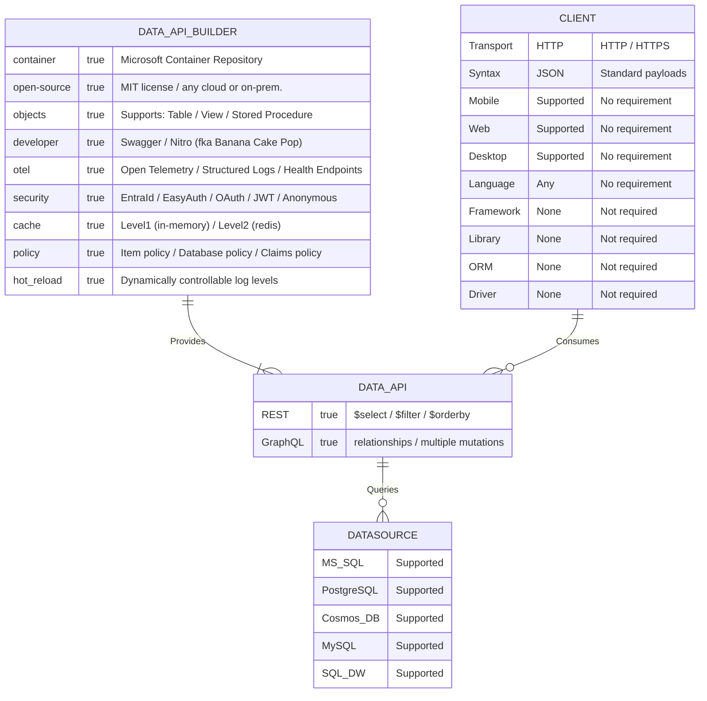
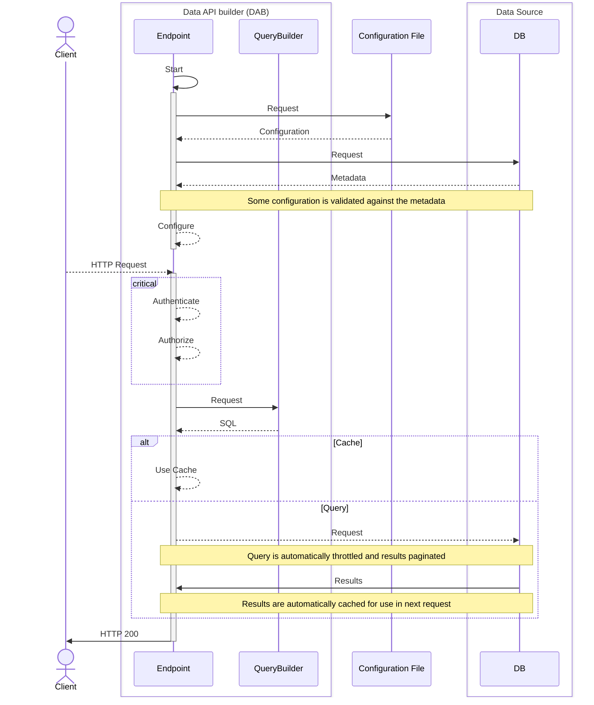

# Data API builder for Azure Databases

[](https://www.nuget.org/packages/Microsoft.DataApiBuilder)
[](https://www.nuget.org/packages/Microsoft.DataApiBuilder)
[](https://learn.microsoft.com/azure/data-api-builder/)
[](https://opensource.org/licenses/MIT)

[What's new?](https://learn.microsoft.com/azure/data-api-builder/whats-new)

## Community

Join the Data API builder community! This sign up will help us maintain a list of interested developers to be part of our roadmap and to help us better understand the different ways DAB is being used. Sign up [here](https://forms.office.com/pages/responsepage.aspx?id=v4j5cvGGr0GRqy180BHbR1S1JdzGAxhDrefV-tBYtwZUNE1RWVo0SUVMTkRESUZLMVVOS0wwUFNVRy4u).


## About Data API builder

Data API builder (DAB) is an open-source, no-code tool that creates secure, full-featured REST and GraphQL endpoints for your database. It’s a CRUD data API engine that runs in a container—on Azure, any other cloud, or on-premises. DAB is built for developers with integrated tooling, telemetry, and other productivity features.



## Getting Started

Use the [Getting Started](https://learn.microsoft.com/azure/data-api-builder/get-started/get-started-with-data-api-builder) tutorial to quickly explore the core tools and concepts. It gives you hands-on experience with how DAB makes you more efficient by removing boilerplate code.

**1. Install the DAB CLI**

The [DAB CLI](https://aka.ms/dab/docs) is a cross-platform .NET tool. Install the [.NET SDK](https://get.dot.net) before running:

```
dotnet tool install microsoft.dataapibuilder -g
```

**2. Create your initial configuration file**

DAB requires a JSON configuration file. Edit manually or with the CLI. Use `dab --help` for syntax options.

```
dab init
  --database-type mssql
  --connection-string "@env('my-connection-string')"
  --host-mode development
```

**3. Add your first table**

DAB supports tables, views, and stored procedures. It works with SQL Server, Azure Cosmos DB, PostgreSQL, MySQL, and SQL Data Warehouse. Security is engine-level, but permissions are per entity.

```
dab add Actor
  --source "dbo.Actor"
  --permissions "anonymous:*"
```

**4. Run Data API builder**

In `production`, DAB runs in a container. In `development`, it’s self-hosted locally with hot reload, Swagger, and Nitro (fka Banana Cake Pop) support.

```
dab start
```

> **Note**: Before you run `dab start`, make sure your connection string is stored in an environment variable called `my-connection-string`. This is required for `@env('my-connection-string')` in your config file to work. The easiest way is to create a `.env` file with `name=value` pairs—DAB will load these automatically at runtime.

**5. Access your data source**

By default, DAB enables both REST and GraphQL. REST supports `$select`, `$filter`, and `$orderBy`. GraphQL uses config-defined relationships.

```
GET http://localhost:5000/api/Actor
```

### Walk-through video

<a href="https://www.youtube.com/watch?v=xAlaoDQolLw" target="_blank">
  
</a>

Demo source code: [startrek](https://aka.ms/dab/startrek)

## Overview

| Category       | Features |
|----------------|----------|
| **Database Objects** | • NoSQL collections<br>• RDBMS tables, views, stored procedures |
| **Data Sources** | • SQL Server & Azure SQL<br>• Azure Cosmos DB<br>• PostgreSQL<br>• MySQL |
| **REST** | • `$select` for projection<br>• `$filter` for filtering<br>• `$orderBy` for sorting |
| **GraphQL** | • Relationship navigation<br>• Data aggregation<br>• Multiple mutations |
| **Telemetry** | • Structured logs<br>• OpenTelemetry<br>• Application Insights<br>• Health endpoints |
| **Advanced** | • Pagination<br>• Level 1 (in-memory) cache<br>• Level 2 (Redis) cache |
| **Authentication** | • OAuth2/JWT<br>• EasyAuth<br>• Entra ID |
| **Authorization** | • Role-based support<br>• Entity permissions<br>• Database policies |
| **Developer** | • Cross-platform CLI<br>• Swagger (REST)<br>• Banana Cake Pop (GraphQL)<br>• Open Source<br>• Hot Reload |

## How does it work?

This diagram shows how DAB works. DAB dynamically creates endpoints from your config file. It translates HTTP requests to SQL, returns JSON, and auto-pages results.



Because DAB is stateless, it can scale up or out using any container size. It builds a feature-rich API like you would from scratch—but now you don’t have to.

## Additional Resources

- [Online Documentation](https://aka.ms/dab/docs)  
- [Official Samples](https://aka.ms/dab/samples)  
- [Known Issues](https://learn.microsoft.com/azure/data-api-builder/known-issues)  
- [Feature Roadmap](https://github.com/Azure/data-api-builder/discussions/1377)

#### References

- [Microsoft REST API Guidelines](https://github.com/microsoft/api-guidelines/blob/vNext/Guidelines.md)  
- [Microsoft Azure REST API Guidelines](https://github.com/microsoft/api-guidelines/blob/vNext/azure/Guidelines.md)  
- [GraphQL Specification](https://graphql.org/)

### How to Contribute

To contribute, see these documents:

- [Code of Conduct](./CODE_OF_CONDUCT.md)  
- [Security](./SECURITY.md)  
- [Contributing](./CONTRIBUTING.md)

### License

**Data API builder for Azure Databases** is licensed under the MIT License. See [LICENSE](./LICENSE.txt) for details.

### Third-Party Component Notice

Nitro (fka Banana Cake Pop by ChilliCream, Inc.) may optionally store work in its cloud service via your ChilliCream account. Microsoft is not affiliated with or endorsing this service. Use at your discretion.

### Trademarks

This project may use trademarks or logos. Use of Microsoft trademarks must follow Microsoft’s [Trademark & Brand Guidelines](https://www.microsoft.com/en-us/legal/intellectualproperty/trademarks). Use of third-party marks is subject to their policies.
