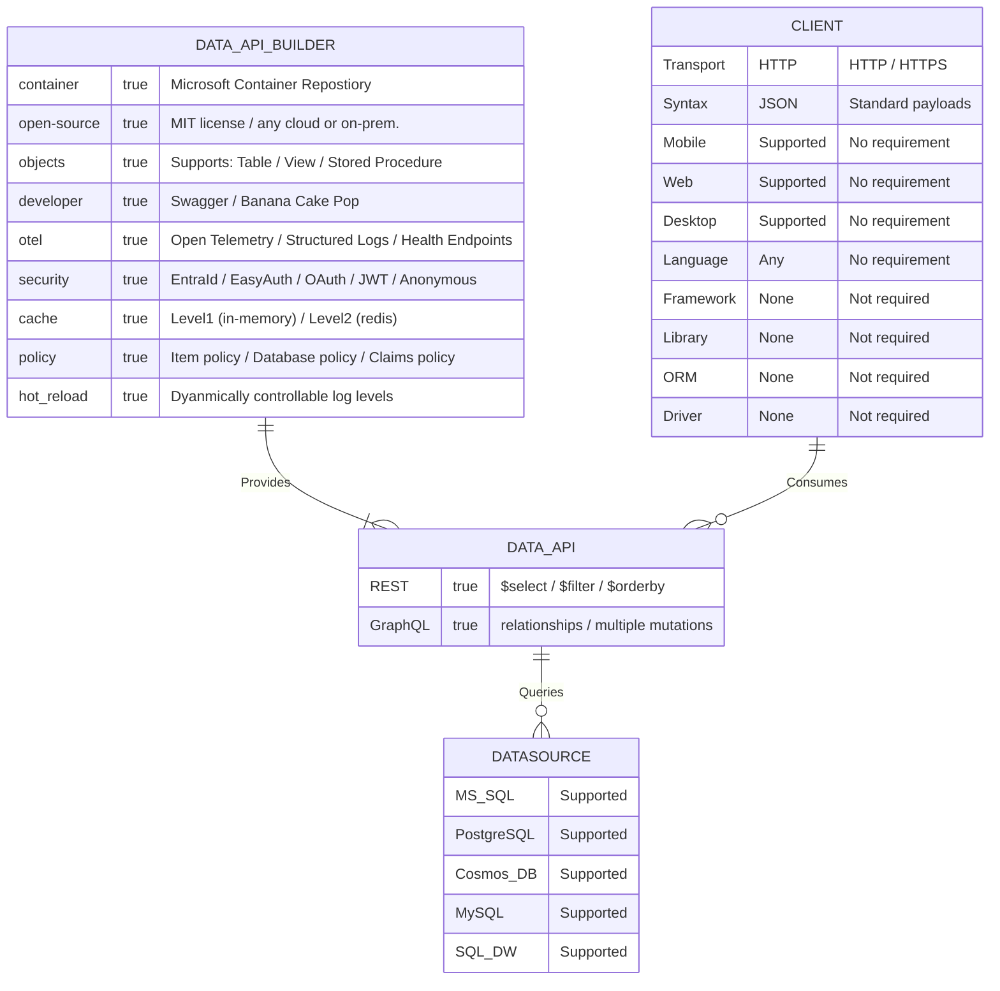
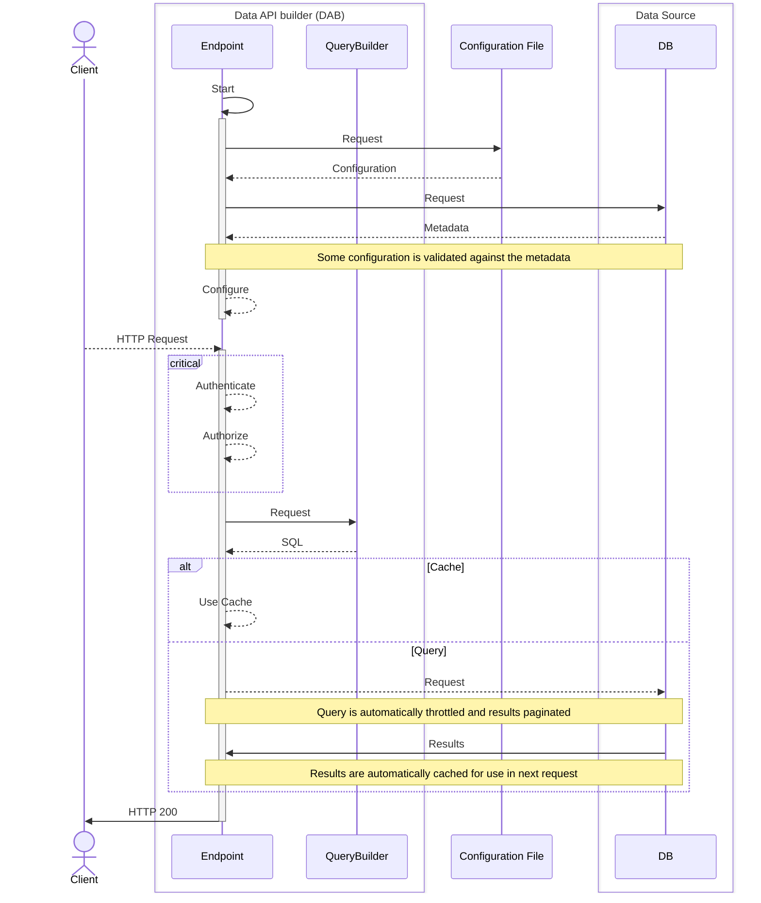

# Data API builder for Azure Databases

[](https://www.nuget.org/packages/Microsoft.DataApiBuilder)
[](https://www.nuget.org/packages/Microsoft.DataApiBuilder)
[](https://learn.microsoft.com/azure/data-api-builder/)
[](https://opensource.org/licenses/MIT)

[What's new?](https://learn.microsoft.com/azure/data-api-builder/whats-new)

## Community

Join the Data API builder community! This sign up will help us maintain a list of interested developers to be part of our roadmap and to help us better understand the different ways DAB is being used. Sign up [here](https://forms.office.com/pages/responsepage.aspx?id=v4j5cvGGr0GRqy180BHbR1S1JdzGAxhDrefV-tBYtwZUNE1RWVo0SUVMTkRESUZLMVVOS0wwUFNVRy4u).


## About Data API builder

Data API builder (DAB) is an open-source, no-code tool that creates secure, full-featured REST and GraphQL endpoints for your database. It is a CRUD Data API engine that runs in a container—in Azure or any other cloud platforms, or even on-premises. DAB is built for developers with integrated tooling, telemetry and other productivity features.



## Overview

| Category       | Features |
|----------------|---------|
| **Database Objects** | • NoSQL collections<br>• RDBMS tables, views, and stored procedures |
| **Data Sources** | • SQL Server & Azure SQL Database<br>• Azure Cosmos DB<br>• PostgreSQL<br>• MySQL<br> |
| **REST** | • `$select` for projection<br>• `$filter`for filtering<br> • `$orderBy` for sorting |
| **GraphQL** | • Relationship natigation<br>• Data aggregation<br>• Multiple mutations (insert) |
| **Telemetry** | • Structured Logs<br>• Open Telemetry<br>• Application Insights (supported)<br>• Health Endpoints<br> |
| **Advanced** | • Pagination<br>• Level 1 cache (in memory)<br>• Level 2 cache (Redis) |
| **Authentication** | • OAuth2/JWT<br>• EasyAuth<br>• EntraId |
| **Authorization** | • Role-based support<br>• Entity permissions<br>• Database policies |
| **Developer** | • Cross-platform CLI<br>• Swagger (REST)<br>• Banana Cake Pop (GraphQL)<br>• Open Source<br>• Hot Reload


## Getting Started

To get started quickly with Data API builder, use the [Getting Started](https://learn.microsoft.com/azure/data-api-builder/get-started/get-started-with-data-api-builder) tutorial; that will help to get familiar with some basic tools and concepts while giving you a good experience on how much Data API builder can make you more efficient, but removing the need to write a lot of plumbing code.

**1. Install the DAB CLI**

The [Data API builder (DAB) CLI](https://aka.ms/dab/docs) is a cross-platform dotnet tool. This means you will need to install the cross-platform [.NET SDK CLI](https://get.dot.net) before running the command indicated below.

```
dotnet tool install microsoft.dataapibuilder -g
```

**2. Create your initial configuration file**

[Data API builder (DAB)](https://aka.ms/dab/docs) requires only a JSON configuration file to work. This can be edited by hand or with the CLI. Developers can use `dab --help` for additional syntax options.

```
dab init
  --database-type mssql
  --connection-string "@env('my-connection-string')"
  --host-mode development
```

**3. Add your first table**

[Data API builder (DAB)](https://aka.ms/dab/docs) supports tables, views, and stored procedures. Data sources include: Microsoft SQL, Azure Cosmos DB, PostgreSQL, MySQL, and SQL Datawarehouse. Though security is configured at the engine-level, permissions are managed at the entity level.

```
dab add Actor
  --source "dbo.Actor"
  --permissions "anonymous:*"
```

**4. Run Data APi builder**

In `production`, Data API builder (DAB) runs in a container. In `development`, DAB is self-hosted on your local machine with support for hot reload, Swagger, and Banana Cake Pop. 

```
dab start
```

**5. Access your data source**

By default, Data API builder (DAB) enables both REST and GraphQL endpoints. REST endpoints support `$select`, `$filter`, and `$orderBy`. GraphQL supports relationships defined in the config.

```
GET http://localhost:5000/api/Actor
```

### Walk-through video

<a href="https://www.youtube.com/watch?v=xAlaoDQolLw" target="_blank">
  
</a>

Demo source code: [startrek](https://aka.ms/dab/startrek)

## How does it work?

This sequence diagram steps through the basic operation of DAB to help you, the developer, understand the fundamentals of the engine. DAB dynamically creates endpoints based on your configuration file, which must match the underlying data source. It automatically translates HTTP requests into SQL queries, converts the results to JSON, and pages the results according to your settings.  



Because DAB is stateless, you can scale it up or out using whatever container size fits your data source and usage needs. Most importantly, we aren’t doing anything exotic—we’re building a feature-rich Data API just like you would from scratch, only now you don’t have to.

## Additional Resources

|Repository|Documentation|Samples|Introduction
|:-:|:-:|:-:|:-:|
|[aka.ms/dab](https://aka.ms/dab)|[aka.ms/dab/docs](https://aka.ms/dab/docs)|[aka.ms/dab/samples](https://aka.ms/dab/samples)|[YouTube Video](https://www.youtube.com/playlist?list=PLYA3nHmjWIYE1PUl8_dVR-yKtCLgVhie4)

### Known Issues

List of known issues and possible workarounds is available here: [Known Issues](https://learn.microsoft.com/azure/data-api-builder/known-issues).

### Development Roadmap

What is the planned development roadmap: [Roadmap](https://github.com/Azure/data-api-builder/discussions/1377).

### How to Contribute

Contributions to this project are more than welcome. Make sure you check out the following documents, to successfully contribute to the project:

- [Code Of Conduct](./CODE_OF_CONDUCT.md)
- [Security](./SECURITY.md)
- [Contributing](./CONTRIBUTING.md)

### References

- [Microsoft REST API Guidelines](https://github.com/microsoft/api-guidelines/blob/vNext/Guidelines.md)
- [Microsoft Azure REST API Guidelines](https://github.com/microsoft/api-guidelines/blob/vNext/azure/Guidelines.md)
- [GraphQL](https://graphql.org/)

### License

**Data API builder for Azure Databases** is licensed under the MIT license. See the [LICENSE](./LICENSE.txt) file for more details.

### Third-Party Component Notice

If you use the third-party software Banana Cake Pop by ChilliCream, Inc., as part of your Data API builder solution, you may have the option to save your work on ChilliCream's cloud service, via your separate ChilliCream account.  Microsoft is not affiliated with and does not endorse ChilliCream's service, and you use those services at your own option.

### Trademarks

This project may contain trademarks or logos for projects, products, or services. Authorized use of Microsoft trademarks or logos is subject to and must follow Microsoft's Trademark & Brand Guidelines. Use of Microsoft trademarks or logos in modified versions of this project must not cause confusion or imply Microsoft sponsorship. Any use of third-party trademarks or logos are subject to those third-party's policies.
