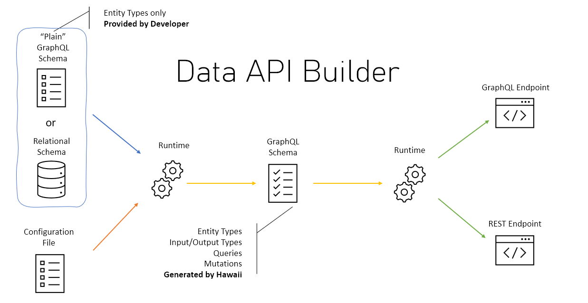

# Data API builder for Azure Databases

Latest version of Data API builder is  **0.4.10** [What's new?](./docs/whats-new.md#version-0410)

## About

**Data API builder for Azure Databases provides modern REST and GraphQL endpoints to your Azure Databases.**

With Data API builder, database objects can be exposed via REST or GraphQL endpoints so that your data can be accessed using modern techniques on any platform, any language, and any device. With an integrated and flexible policy engine, granular security is assured; integrated with Azure SQL, SQL Server, PostgreSQL, MySQL, MariaDB and Cosmos DB, gives developers an efficiency boost like never seen before.

## Features

- Allow collections, tables, views and stored procedures to be accessed via REST and GraphQL
- Support authentication via JWT and EasyAuth
- Role-based authorization using received claims
- Item-level security via policy expressions
- REST
  - CRUD operations via POST, GET, PUT, PATCH, DELETE
  - filtering, sorting and pagination
- GraphQL
  - queries and mutations
  - filtering, sorting and pagination
  - relationship navigation
- Easy development via dedicated CLI

## Getting Started

To get started quickly with Data API builder for Azure Databases, you can use the [Getting Started](./docs/getting-started/getting-started.md) tutorial, that will help to get familiar with some basic tools and concepts while giving you a good experience on how much Data API builder for Azure Databases can make you more efficient, but removing the need to write a lot of plumbing code.

## Documentation

Documentation is available in the [`docs`](./docs) folder.

## Limitations

- JWT only supports Azure AD

## Known Issues

List of known issues and possible workarounds, where applicable and possible, is available here: [Known Issues](./docs/known-issues.md).

## How to Contribute

Contributions to this project are more than welcome. Make sure you check out the following documents, to successfully contribute to the project:

- [Code Of Conduct](./CODE_OF_CONDUCT.md)
- [Security](./SECURITY.md)
- [Contributing](./CONTRIBUTING.md)

If you want to propose a completely new feature, please create an RFC item. Good examples of how to create RFC can be found here:

- [Rust RFC Template](https://github.com/rust-lang/rfcs/blob/master/0000-template.md)
- [Python PEP Guidance](https://www.python.org/dev/peps/pep-0001/#what-belongs-in-a-successful-pep)

## References

- [Microsoft REST API Guidelines](https://github.com/microsoft/api-guidelines/blob/vNext/Guidelines.md)
- [Microsoft Azure REST API Guidelines](https://github.com/microsoft/api-guidelines/blob/vNext/azure/Guidelines.md)
- [GraphQL](https://graphql.org/)
