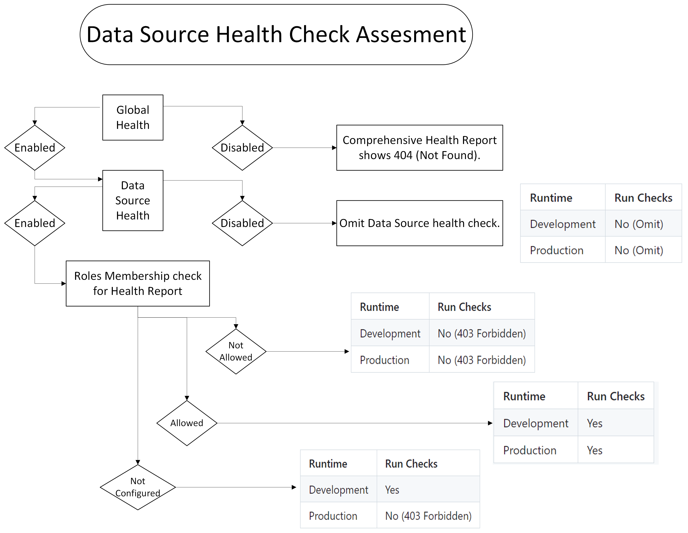
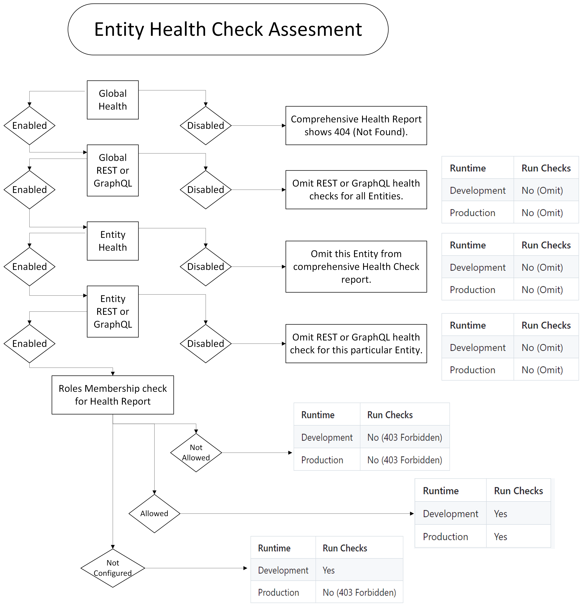

# Design Document: DAB Health Endpoint
## Objective:
The objective of this task is to enhance the "Health Endpoint" for DAB. Currently we only show whether the DAB Engine is healthy or not with a small description of the version.\
However, the objective under this task item is to enhance the health endpoint to support detailed description of each enabled entity by performing health checks on them based on different kinds of properties that would be defined below.

## Need for DAB Health Check Endpoint
Azure App Service & Azure Kubernetes Service (AKS) support health probes to monitor the health of your application. If a service fails health checks, Azure can automatically restart it or redirect traffic to healthy instances.\
Similarly, we need a Health Endpoint for Data API builder because if it fails health checks in a way a customer deems past a threshold, they have the option to recycle the container or send an alert to direct engineers.

## Current Setup
There is no official industry standard for the health endpoint. /health or variations like /_health are common by convention.\
Currently, the DAB application uses a built-in class in ASP.NET Core i.e. `Microsoft.Extensions.Diagnostics.HealthChecks` library for generating DAB Health check report. We use `HealthReportResponseWrite` class to emit the `HealthReport` object including `HealthReportEntry` dictionary. The object `DabHealthCheck` includes a description of version (Major.Minor.Patch) and app name (dab_oss_Major.Minor.Patch). Finally it generates a `HealthCheckResult` such as the following one.
```
{
    "status": "Healthy",
    "version": "Major.Minor.Patch",
    "appName": "dab_oss_Major.Minor.Patch"
}
```

This is generated in the `Startup.cs` file when mapping the base URL `(/)` to the health check endpoint to get the high level result for DAB Engine Health using this command `ResponseWriter = app.ApplicationServices.GetRequiredService<HealthReportResponseWriter>().WriteResponse`.

| **Term**           | **Description**                                         |
|--------------------|---------------------------------------------------------|
| **Health Endpoint** | The URL (e.g., `/`) exposed as JSON.             |
| **Check**           | A specific diagnostic test (e.g., database, API).      |
| **Status**          | The result of a check.                                 |
| **Status.Healthy**  | The system is functioning correctly.                   |
| **Status.Unhealthy**| The system has a critical failure or issue.            |

## Proposed Change
We want to create a detailed version of the `Health endpoint for DAB Engine` with information regarding all REST and GraphQL endpoints and their behavior. Here we would update the configuration schema to include some properties which would be required from the user to perform all checks on that data-source/entity (described below) to validate if they are healthy.\
`We would have the basic health results displayed at the '/' (root) and create a new endpoint '/health' for the comprehensive health report depending on a mixture of if health is enabled and the user meets the roles requirement.`\
We want the user to provide a check and threshold value for each entity for which health is enabled and DAB engine would carry out this check. If the result is under the threshold, the DAB Engine would be considered `healthy` for that endpoint, else `unhealthy`.

### **Overall Health Calculation**
| **Healthy** | **Unhealthy** | **Global Status** |
|------------|--------------|-------------------|
| -          | 0            | `Healthy`        |
| -          | ≥ 1          | `Unhealthy`      |

- **Healthy**: All checks pass.  
- **Unhealthy**: At least one check fails. 

The time elapsed to run the query for DB or Entity (Rest or GraphQL) is compared to the threshold(ms) as given in the config. The value of healthCheck is given based on the condition below. In case of any error while executing the healthCheck query, we consider the "Unhealthy" and specify the exception message appropriately.\
`HealthCheck = time_Elapsed_ms < threshold_ms ? Healthy : Unhealthy`

**By default the DAB Comprehensive Health Check would be enabled `true` for datasource and all entities in both development and production mode of deployment. User will have to mark datasource.enabled or entity-name.enabled to false to mark this comprehensive check as disabled for particular data source or entity.** 

**Case 1: Datasource**\
Carry out standard queries based on the datasource type and execute them under the given threshold. If the engine gets the result below the specified threshold, the DB is considered healthy else unhealthy.

> Example: If we have a SQL Server, we would execute the standard query given below in the document for SQL Server. If the elapsed time for this query is under the given threshold, the data source would be considered healthy.


**Case 2: Entity**\
In case of entities we would ask the user to provide a number in the config as the "first" property which would specify the number of items to return in the query (Default is 100). We would use this number to form REST and GraphQL queries and hit our DAB endpoints to check their results.

> Example: In case for entity `UserTable` we say that we need to run a health query with first = 5 under 100ms threshold. While running the DAB Engine we would execute the REST endpoint for `UserTable` and fetch the first 5 rows and similar for GraphQL and check if the threshold is under 100ms. If so, it would be consider healthy entity.

Lower level details about the two cases are described in the document below.

## Implementation Details
### High-Level Schema
Health check responses follow a common convention rather than a strict standard. The typical pattern involves a "checks" property for individual components' statuses (e.g., database, memory), with each status rolling up to an overall "status" at the top level.
```
{
  "status": "Healthy",
  "checks": [
    { "name": "check-name", "status": "Healthy" ... },
    { "name": "check-name", "status": "Healthy" ... }
  ]
}
```

### Configuration Updates
The customer needs to update the `dab-config.json` file to include details of the health check for different configuration settings like runtime, data source and entities. 

#### `runtime.health` Configuration
The runtime configuration would include details like `cache-ttl-seconds` in case we need to cache the response of health checks, the `max-dop` value which specifies the degree of parallelism i.e. how many queries that DAB should run in parallel and `roles` i.e. all roles which are allowed to view the comprehensive health information of DAB engine.

| **Property**   | **Data Type** | **Required** | **Default** | **Description**                                                                                      |
|----------------|---------------|--------------|-------------|------------------------------------------------------------------------------------------------------|
| `enabled`     | Boolean       | No           | `true`      | Enables or disables the comprehensive health checks for DAB Engine. **In case it is disabled, the '/health' updated health endpoint returns 404 (Not Found).**                                            |
| `cache-ttl-seconds`   | Integer       | No           | `5`         | Time-to-live (in seconds) for caching health check results. **If this value is not specified or is 0, caching would not be enabled.** Currently, caching is not implemented hence, value is considered to be null. Will be done subsequently.                                       |
| `max-dop`     | Integer       | No           | `8`         | Maximum Degree of Parallelism for running health checks.                                             |
| `roles`       | Array of strings         | <table><tr><th>Environment</th><th>Required</th></tr><tr><td>Development</td><td>No</td></tr><tr><td>Production</td><td>Yes</td></tr></table>   | <table><tr><th>Environment</th><th>Default</th></tr><tr><td>Development</td><td>["anonymous"]</td></tr><tr><td>Production</td><td>NA</td></tr></table>        | List of Roles allowed to access the comprehensive health endpoint (e.g., `anonymous`, `authenticated` or `custom-role`).                   |

```
{
  "runtime": {
    "health": {
      "enabled": true,
      "cache-ttl-seconds": 5,
      "max-dop": 5,
      "roles": ["anonymous", "authenticated"]
    }
  }
}
```

#### `data-source.health` Configuration

The database type in the data source health config determines the query that we should run on the data source. The time to run this query should come under the user specified threshold-ms to qualify as a healthy data source for DAB. We get the database type from the runtime properties to get the query to run on the specific DB Type.\
**This check opens a connection to the data source and validates the connection string and network access. Further it runs a simple query to validate user permissions and responsiveness for the DB.**

| **Property**      | **Data Type** | **Required** | **Default** | **Description**                                                                                      |
|-------------------|---------------|--------------|-------------|------------------------------------------------------------------------------------------------------|
| `enabled`         | Boolean       | No           | `true`      | Enables or disables health checks for the data source.                                             |
| `name`         | String        | No           | Database Type `runtime.data-source.database-type`     | Identifier for the data source. Useful when multiple data sources exist, to identify each independently in the health check.  
| `threshold-ms`    | Integer       | No           | `10000`     | Threshold in milliseconds for the query response time before the check is considered unhealthy. Minimum : 1 Maximum: INT_MAX. Zero is not allowed.      |

```
{
  "data-source": {
    "health": {
      "name": "sqlserver",
      "enabled": true,
      "threshold-ms": 100
    }
  }
}
```

#### `<entity-name>.health` Configuration

The Entity config settings contain information about the `first` which defines the number of rows to be returned when executing a READ operation on the data source entity and under what threshold should the response be received for it to qualify as a healthy entity.
| **Property**     | **Data Type** | **Required** | **Default** | **Description**                                                                                      |
|------------------|---------------|--------------|-------------|------------------------------------------------------------------------------------------------------|
| `enabled`        | Boolean       | No           | `false`      | Enables or disables health checks for the specific entity.                                          |
| `first`          | Integer       | No           | `100`         | Number of records to query during the health check. Value is used to create the SELECT query to fetch records for REST and GraphQL endpoints. Minimum : 1 Maximum: INT_MAX. Zero is not allowed.                                                |
| `threshold-ms`   | Integer       | No           | `10000`     | Threshold in milliseconds for the query response time before the check is considered unhealthy. Minimum : 1 Maximum: INT_MAX. Zero is not allowed.     |

```
{
  "<entity-name>": {
    "health": {
      "enabled": true,
      "first": 1,
      "threshold-ms": 100
    }
  }
}
```

#### Example
```
{
  "runtime" : {
    ...
    "health" : {
      "enabled": true, (default: true)
      "cache-ttl-seconds": 5, (optional; default: null) // Default value would be updated to 5sec once caching is enabled
      "max-dop": 5, (optional; default: 1) // Default value would be updated to 8 once parallelization is enabled
      "roles": ["anonymous", "authenticated"] // More in detail Later
    }
  },
  "data-source" : {
    ...
    "health" : {
      "name": ["mssql"], (optional; default: Database Type)
      "enabled": true, (default: true)
      "threshold-ms": 100 (optional; default: 10000)
    }
  },
  "entities":{
    "<entity-name>": {
      "health": {
        "enabled": true, (default: true)
        "first": 1 (optional; default: 100),
        "threshold-ms": 100 (optional; default: 10000)
      },
      ...
    },
  }
}
```
The idea of using this updated configuration is to allow the developer to influence how the health checks work against the datasource/entity. This would provide them with a more detailed process for checking if DAB engine is healthy and would give them an enhanced user experience. 

### Permissions for Health Check Report (Roles)
We focus on two aspects in terms of roles for health report. 

+ Health Report Access\
We validate if the incoming user has access to the comprehensive health check report i.e. check the allowed roles in the `runtime.health.roles` array in the config. Only if the user has access, we display the health report, else we show a 403 Forbidden error message.
+ Read Permissions Access\
We check if this incoming role is allowed to perform the `read` query on the DB. For this we focus on the entity section in the config, where the incoming role should be added with `read` permissions. Else, the http client trying to run the `read` command will fail with 403. We return the error message from http client with Unhealthy status. 

> For data source health check we only need to check health report access but for entities (rest and graphql) we run both health report access and read permissions access. 

There are three kinds of roles in DAB.\
System roles are built-in roles recognized by Data API builder. A system role is auto assigned to a requestor regardless of the requestor's role membership denoted in their access tokens. There are two system roles: anonymous and authenticated.
+ Anonymous\
This is the superset of all roles meaning if the roles array contains anonymous, then we don't have to evaluate any further. All authenticated and custom roles are given permissions to view the health endpoint. The anonymous system role is assigned to requests executed by unauthenticated users. Runtime configuration defined entities must include permissions for the anonymous role if unauthenticated access is desired.
+ Authenticated\
The authenticated system role is assigned to requests executed by authenticated users. All custom roles are part of Authenticated role. If the roles array contains authenticated at the top role, then all custom roles are validated.
+ Custom Roles\
Custom roles are non-system roles that are assigned to users within the identity provider you set in the runtime config. They need to specifically match with the incoming user to authenticate the health request.

> Example: In Static Web Apps, a user is a member of the anonymous role by default. If the user is authenticated, the user is a member of both the anonymous and authenticated roles. Because Data API builder evaluates requests in the context of a single role, it evaluates the request in the context of the system role authenticated by default.If the client application's request includes the HTTP header `X-MS-API-ROLE` with a custom value, the request is evaluated in the context of the 'custom role'. 

**Access to comprehensive health report is measured via the `runtime.health.roles` array where `anonymous` is added to allow unauthenticated access to an entity, `authenticated` is added to allow all custom roles, and `custom-role` is added to allow that specific role to view the report.**

**Important Point to Note**

In case of Development and Production mode of deployment for DAB, we have certain changes in role permissions. The below table shows cases whether health checks are run if roles are not configured, allowed, and not allowed.

| Role Membership | Health Check
| - | - |
|{not configured} | <table><tr><th>Runtime</th><th>Run Checks</th></tr><tr><td>Development</td><td>Yes</td></tr><tr><td>Production</td><td>No (403 Forbidden) </td></tr></table> |
| Allowed | <table><tr><th>Runtime</th><th>Run Checks</th></tr><tr><td>Development</td><td>Yes</td></tr><tr><td>Production</td><td>Yes</td></tr></table> |
| Not Allowed | <table><tr><th>Runtime</th><th>Run Checks</th></tr><tr><td>Development</td><td>No (403 Forbidden)</td></tr><tr><td>Production</td><td>No (403 Forbidden)</td></tr></table> |

### Base URL for DAB
While running the health checks for entities, we need the BASE URL on which DAB is running. This BASE URL is used to run all datasource, rest and graphql health check queries for our engine. This base URL is identified during runtime by using `httpcontext`. The following command fetches the base URL upon which all health checks would be run subsequently. 
```
string path = UriHelper.GetEncodedUrl(httpContext!.Request).Split('?')[0];
```

## Health Endpoint Report Calculation 
This section contains details on how the health check details are calculated and Comprehensive Health Check report is formulated at the newly updated endpoint: `/health`.

> Case 1: `runtime.health.enabled` is false/null\
The endpoint returns a 404 (Not Found) error response when hitting the page as comprehensive health check report is disabled.

> Case2:  `runtime.health.enabled` is true\
The endpoint returns the comprehensive health check report after executing the checks for data-source and entities.

### Configuration Settings
The Health Report also contains a section for the configuration summary for the health checks. It provides information about various settings being enabled or disabled in the global runtime section. 
It includes the following
+ Http
+ Https
+ Rest
+ GraphQL
+ Telemetry
+ Caching
+ Mode of Deployment

> NOTE that BASIC health does NOT include configuration.

### Application Name
The application name created by DAB that is appended to data source connection string; is a rich string that exposes a lot of internal stuff. This would be enhanced in the future, hence use the `GetDataApiBuilderUserAgent()` function from the `ProductInfo` class to fetch this for the health report. 

### DataSource Health Check
DAB Config has two properties in the `data-source.health` config section. (Enabled and threshold-ms)\
For each database, we execute a standard query (given below) to get the time elapsed result (ms) for that DB and use this value to compare with threshold according to the [Overall Health Calculation](#overall-health-calculation) and get the status as `Healthy/Unhealthy`.

The standard queries that would be run on each Database Type are the following
+ Postgres: SELECT 1;
+ MySQL: SELECT 1;
+ Cosmos DB: SELECT VALUE 1; (for SQL API)
+ MS SQL: SELECT 1;


**Here we add the tag `database` in the tags array to differentiate the datasource health check result from the entity health check result where `endpoint` is being added to Tags array.**

```
{
  "checks": [
    {
      "name": "<database-type>",
      "status": "Healthy/Unhealthy",
      "tags": ["database", "<database-type>"],
      "data": {
        "duration-ms": , // Response time of query in ms
        "threshold-ms": , // Max Allowed response time for query in ms
      }
    }
  ]
}
```

### Entity Health Check

In the config, for each entity we have three health properties (Enabled, First and Threshold) 

+ Enabled: This would define whether we need to run the comprehensive health check for this role
+ First: This would be used to create the query for endpoints to fetch first 'x' records from the DB.
+ Threshold: This is used to check the time elapsed to run the above query.

To form the query we run a for loop against the entities in the config file. For each entity, we add two objects in the output checks array; first for REST and second for GraphQL. These objects are differentiated using the Tags array in the output report. For each rest or graphql we add the appropriate tag in the array for filtering. 
```
{
  "checks": [
    {
      "name": "<entity-name>",
      "status": "Healthy/Unhealthy",
      "tags": ["rest/graphql", "endpoint"],
      "data": {
        "duration-ms": , // Response time of query in ms
        "threshold-ms": , // Max Allowed response time for query in ms
      }
    }
  ]
}
```

#### Rest Query
We take the base URL and append the REST path in the suffix to get `<baseUrl>/<runtime.rest.path>`. (Default Rest Path: /api)\
For each entity, we need to build the rest query url using the above path as prefix. We build the entity REST path using `<entity-name>.rest.path ?? entityName`. This means if the path is given use that, else the entity name is the path to append to suffix.
Further our call becomes `<baseUrl>/<runtime.rest.path>/<entity-name>.rest.path`.

Finally we add the query parameter which is the first 'x' values to get the final query as **`<baseUrl>/<runtime.rest.path>/<entity-name>.rest.path?$first=x`**.

This query is then executed to get the elapsed time and we use this value to compare with threshold according to the [Overall Health Calculation](#overall-health-calculation) and get the status as `Healthy/Unhealthy`.

#### GraphQL Query

To execute this query we first need to get the schema of that particular entity. After fetching the schema, we get the column names which are then used to create the payload for the GraphQL endpoint to check the health.
For this we run a **POST** query against the base URL `<baseUrl>/<runtime.graphql.path>` with a Request BODY.\
To create the request body we need to fetch the primitive column names for this entity. 

##### **Fetch Column Names**
To get column names for an entity, we use the 'MetadataProvider' for each DB Type. Each Metadata Provider has `EntityToDatabaseObject` which can be used to write the function `GetSchemaGraphQLFieldNamesForEntityName()` which provides the primitive column names for each entity.\
The `EntityToDatabaseObject` is a Dictionary with key as string containing the name of entity and value as DatabaseObject containing the metadata of the entity. This DatabaseObject contains a parameter `SourceDefinition` which holds information about the database table definition. It contains properties that are common between a database table and a view. This SourceDefinition contains a parameter `Dictionary<string, ColumnDefinition> Columns` which has key as column name and value as basic details of the column. 

**GraphQL Query**\
After getting column names array (`columnNames`) for the entity we create the graphQL query payload 
```
query = $"{{{entityName.ToLowerInvariant()}(first: {First}) {{items {{ {string.Join(" ", columnNames)} }}}}}}"
````
We execute a **POST** query against the GraphQL base URL to calculate time elapsed for health check and use this value to compare with threshold according to the [Overall Health Calculation](#overall-health-calculation) and get the status as `Healthy/Unhealthy`.

CURL Command
```
curl --request POST \
  --url <baseUrl>/<runtime.graphql.path> \
  --header 'Content-Type: application/json' \
  --header 'User-Agent: insomnia/10.3.0' \
  --data '{
	"query": "{UserTable(first: 4) {items { content id }}}"
}'
```

## Output Sample
After executing the above queries for DB and entities, we create the below sample for comprehensive Health Check Report.
```
{
  "status": "Unhealthy/Healthy",
  "version": "1.2.10",
  "app-name": "dab_oss_1.2.10",
  "configuration": {
    "http": true,
    "https": true,
    "rest": true,
    "graphql": true,
    "telemetry": true,
    "caching": true,
    "mode": "development"
  },
  "checks": [
    {
      "name": "database-name",
      "status": "Healthy",
      "tags": ["data-source", "mssql"],
      "data": {
          "duration-ms": 10,
          "threshold-ms": 100
      }
    },
    {
      "name": "<entity-name>",
      "status": "Healthy",
      "tags": ["endpoint", "rest"],
      "data": {
          "duration-ms": 2,
          "threshold-ms": 10
      }
    },
    {
      "name": "<entity-name>",
      "status": "Healthy",
      "tags": ["endpoint", "graphql"]
      "data": {
          "duration-ms": 20,
          "threshold-ms": 50
      }
    },
    {
      "name": "<entity-name>",
      "status": "Unhealthy",
      "tags": ["endpoint", "rest"]
      "exception": "{exception-message-here}",
      "data": {
          "duration-ms": 20,
          "threshold-ms": 20
      }
    },
    {
      "name": "<entity-name>",
      "status": "Unhealthy",
      "tags": ["endpoint", "graphql"]
      "exception": "{exception-message-here}",
      "data": {
          "duration-ms": 20,
          "threshold-ms": 10
      }
    },
  ]
}
```

## Test Scenarios

Health Check result scenarios for different cases of Health checks for DataSource, Rest and GraphQL entities to be enabled or disabled.






> **Important Point to Note**: In case the Role Membership for Health is successful, then we run the REST/GraphQL query on the entity. While running the query, if we find out that the user's role doesn't have the permissions to perform this read operation, we return 403 (Forbidden) and forward the exception that HttpClient provides. 

## Limitations 

+ We do not support health checks for stored procedures.
+ Hot-Reload is not supported in Comprehensive Health Endpoint.
