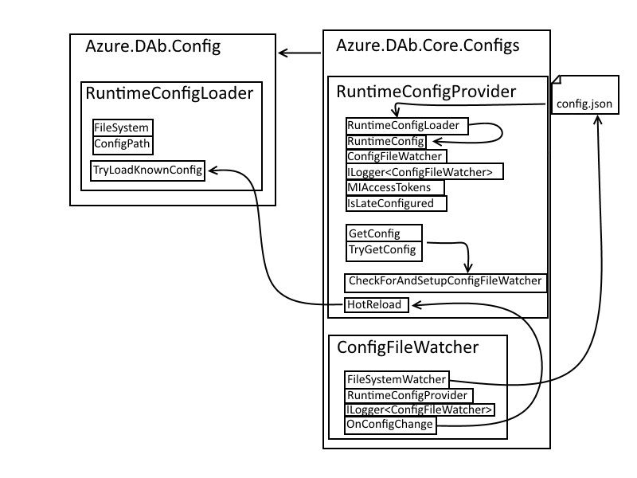

# Design Document: Hot Reloading for Runtime Configuration
## Objective:
The objective of this task is to enable "hot reloading" of the config file when we are not in a hosted scenario and the Host Mode is set to `development`, in other words, in a local development scenario. This will be extensible so that we can enable hot-reload through additional options in the future, such as additional config properties or with an option within the CLI.  To start, we will implement this feature to be working with a scope limited to those properties that are associated with the runtime of dab. Those properties of the config that are setup during the startup of dab will need to be implemented after this initial runtime work. 

## Investigation into IOptionsMonitor
`IOptionsMonitor` seemed to provide a built in pattern for hot-reloading that could be used directly with '.NET'. This would also allow for individual options within the config to easily be reloaded on their own. However, after some investigation it became apparent `IOptionsMonitor` would not be able to integrate easily into dab in such a way that it would automatically handle the hot-reload scenario. Because of the way we instantiate our object model of the configuration file, using `IOptionsMonitor` in such a way is not possible at this time. 

## Current Setup:
Currently, the application uses a `RuntimeConfig` class, which is a record. It holds a string as the `Schema`, and record types, implemented as the classes `DataSource`, `RuntimeOptions`, and `RuntimEntities`. The `RuntimeConfig` is populated through the `RuntimeConfigProvider` which makes use of the `RuntimeConfigLoader` to handle the reading of the configuration and deserializing into the needed objects. As mentioned, the `RuntimeConfig` consists of three major sections: DataSource, Runtime, and Entities. While we consider all sections, to start this task, we will focus on the Runtime section.

## Proposed Changes:
We will modify the application to support hot reloading of the confiuration file when we are in a valid hot-reload scenario, which initially will mean that dab was started for local development. This means that when the config file is changed and the application is running, if dab was started in development mode for a non-hosted scenario, then the objects populated to form the `RuntimeConfig` will be updated to reflect the changes to the config file without requiring a service restart. Because the `RuntimeConfig` is a record, a new one will need to be created entirely.

## Implementation Steps:
### File Monitoring:

Implement a file monitoring mechanism to watch for changes in the the config file. This will involve using the `.NET` `FileSystemWatcher` as a part of a class we implement as the `ConfigFileWatcher`. This object will need to be instantiated during startup so that hot reloading is possible prior to the application being usable. The file monitor will also need to make a callback in order to trigger the updating, which means it will need a reference to the `RuntimeConfigProvider`, which is the class responsible for handling the `RuntimeConfig`. This `RuntimeConfigProvider` handles both the calling into the file loader to create the `RuntimeConfig` and also provides access to the `RuntimeConfig` once it is created. Our file monitoring class will therefore be coupled to the `RuntimeConfigProvider`. This has some implications that need to be taken into account for implementation, see below for additional details.

#### Additional Implementation Details:
This fact, that the `RuntimeConfigProvider` is the one that is handling access to and the triggering of loading of the `RuntimeConfig` needs to be taken into consideration as an implementation detail. This is because the `RuntimeConfigProvider` has a `RuntimeConfigLoader`, and therefore the namespace that the `RuntimeConfigProvider` is within, `namespace Azure.DataApiBuilder.Core.Configurations` needs to reference the namespace that the `RuntimeConfigLoader` is within, `namespace Azure.DataApiBuilder.Config`. Since the `ConfigFileWatcher` will need a reference to the `RuntimeConfigProvider`, it will not be possible to have it live within the class or the project of the `RuntimeConfigLoader`, because this will create a circular dependancy. We therefore have decided to place the `ConfigFileWatcher` in the same namespace as the `RuntimeConfigProvider` and strongly couple the `ConfigFileWatcher` to the `RuntimeConfigProvider`. 

#### Watching Multiple Files:
An additional consideration is that in order to handle hot reloading of the sections outside of the runtime section we may need to walk a tree of config files. Since with recent changes we can now reference another configuration file, which can itself reference another configuration file, to be certain that we are hot reloading when any change is made to a configuration file, we will need to walk that tree and monitor all of those files. However, this will only be needed for the sections beyond the runtime section, because the root in this tree will always have the runtime data. We also need to be watching the Cosmos schema file, which can be updated without the config file being changed.

### Hot Reloading Trigger:

Define a trigger mechanism to initiate the hot reloading process when changes are detected in the config file. This trigger function will then call into the `RuntimeConfigProvider` initiating the update of the `RuntimeConfig` by reloading the new config and creating a new object model. This trigger function lives in the `ConfigFileWatcher` and during construction we register this function with the underlying `FileSystemWatcher.Changed` field. This function then calls into the `RuntimeConfigProvider` which has a hot reload function that will then use the config loader to create the new object model that we save as the `RuntimeConfig` in the `RuntimeConfigProvider`.

### Config Object Update:

When the hot reloading is triggered, create a new `RuntimeConfig` record using the same deserialization process as on startup. We call into this through the same function provided by the config loader that we use on startup. To be certain that we are updating the objet model correctly, based on the correct config file, we do this update using the same full path that was used during deserialization on startup.

The regular deserialization process should then be able to handle walking the tree of referenced config files, but this is something that needs to be confirmed with correct testing.

### Event Driven Updates:

Simply refreshing the object map that is held in memory to reflect a new config file is not enough to fully support hot-reloading. A number of the properties of the config file are used during startup to configure various parts of dab. Those various services that depend on the config during startup will need to be reloaded to reflect the hot-reloaded changes to the config. To accomplish this we will use an event driven design. We already have an event representing a change to the config, and we will also need an event to signal that a hot-reload is taking place. The various services that are configuring on startup will then need to subscribe to this event, and when a hot-reload happens, they will have the steps needed to refresh their settings triggered.

# Potential Classes

## GraphQLSchemaManager Class:

### Responsibilities:
Handles dynamic updates to the GraphQL schema based on changes in the entities.
Validates and applies the updated schema. Note that we do not have to worry about concurrency as this is in the local dev scenario and inconsistent behavior with active requests is expected when hot reloading the config file.

# Diagram

