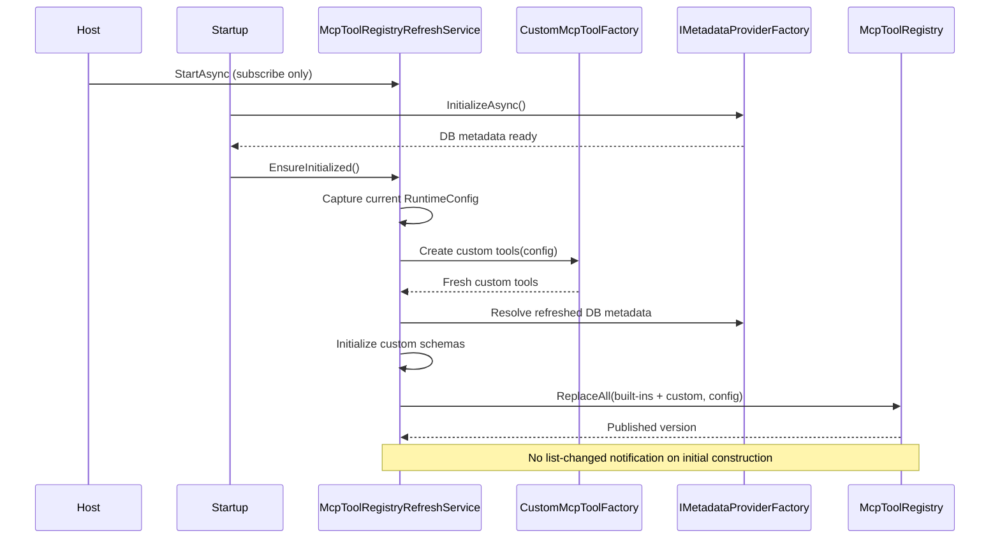
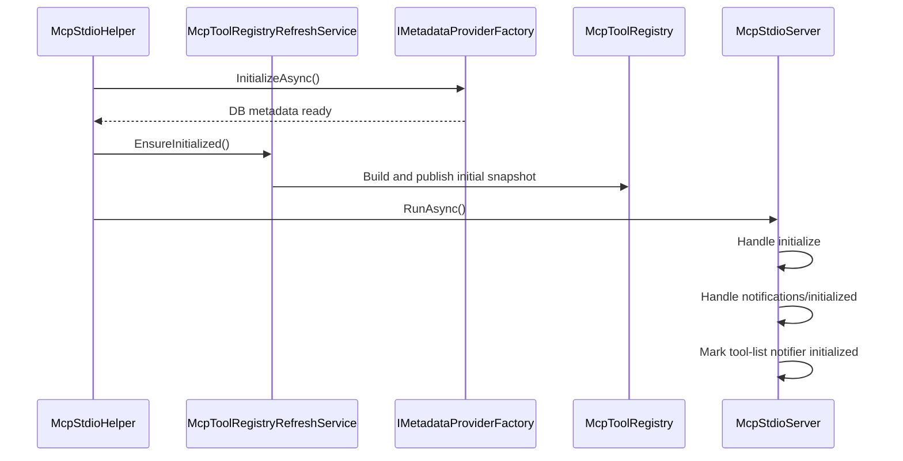
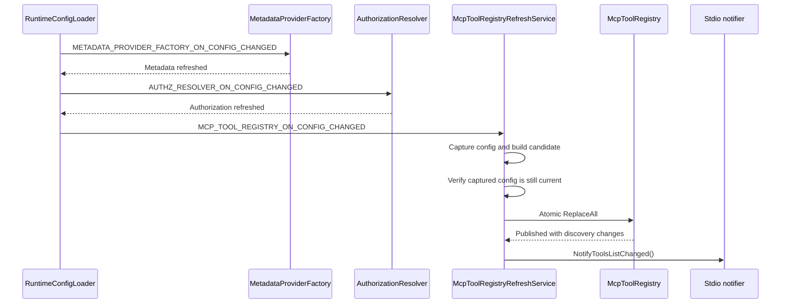
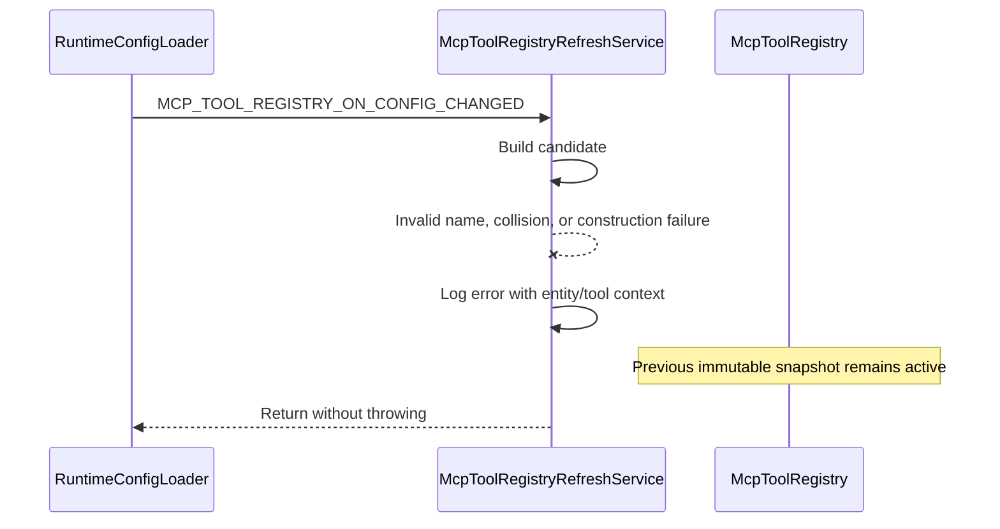

# Design Document: MCP Tool Registry Hot-Reload

## Status

Proposed.

This document describes the agreed design for refreshing Data API builder's MCP tool registry when runtime configuration is hot-reloaded. It is intended to guide implementation and review.

Source links in this document point to the current implementation that will be changed; they are not examples of the proposed implementation.

## Summary

DAB currently builds its MCP tool registry once at startup. A hot-reloaded `RuntimeConfig` can change which custom tools exist and can change their names, descriptions, and input schemas, but the registry continues serving the startup tool instances and startup metadata.

The proposed design keeps `McpToolRegistry` as a singleton and changes its contents to an atomically published immutable snapshot. A singleton refresh service builds a complete candidate snapshot after the existing metadata, engine, and authorization hot-reload handlers have run. If candidate construction succeeds, the service atomically swaps the snapshot. If it fails, the previous snapshot remains active.

The design also sends `notifications/tools/list_changed` to an initialized stdio client when the advertised tool list or metadata changes. HTTP requests always read the current snapshot, but HTTP push notifications are deferred because the installed MCP SDK requires experimental session tracking APIs for broadcast notifications.

## Motivation

Custom MCP tools are generated from stored-procedure entities with `mcp.custom-tool` enabled. Today, those tools are constructed from the startup configuration and registered as DI singletons. The registry is then populated once by a hosted service.

Consequently, a configuration hot-reload can leave MCP discovery stale in several ways:

- A newly enabled custom tool does not appear.
- A removed or disabled custom tool remains registered.
- Renaming an entity does not update the tool name.
- Changing an entity description does not update the tool description.
- Changing stored-procedure parameters does not update the advertised input schema.
- A custom tool can retain metadata derived from an old database metadata generation.

Built-in tool visibility already evaluates the current configuration during each `tools/list` request, but it is combined with a fixed startup registry. This avoids some stale built-in visibility, but does not solve stale custom tools or provide a single consistent registry generation.

## Previous Implementation

### Registry construction

Before this change, [McpServiceCollectionExtensions.cs](../../src/Azure.DataApiBuilder.Mcp/Core/McpServiceCollectionExtensions.cs):

1. Registers `McpToolRegistry` as a singleton.
2. Registers `McpToolRegistryInitializer` as a hosted service.
3. Discovers built-in `IMcpTool` implementations and registers them as singletons.
4. Builds custom tools from the startup `RuntimeConfig` and registers each custom tool as a singleton.

The former `McpToolRegistryInitializer` resolved every `IMcpTool` and registered it once when the host started.

[McpStdioHelper.cs](../../src/Service/Utilities/McpStdioHelper.cs) separately initializes the registry because stdio mode deliberately builds, but does not start, the ASP.NET Core web host.

### Registry state

[McpToolRegistry.cs](../../src/Azure.DataApiBuilder.Mcp/Core/McpToolRegistry.cs) stored tools in a mutable, case-insensitive `Dictionary<string, IMcpTool>`. It supported individual registration, lookup by name, and filtering enabled tools using a supplied `RuntimeConfig`.

The dictionary is safe under current startup-only mutation, but it cannot be modified concurrently with MCP requests.

### Custom tool metadata

[DynamicCustomTool.cs](../../src/Azure.DataApiBuilder.Mcp/Core/DynamicCustomTool.cs) captures an `Entity` at construction time. Its tool name, description, and configuration-based parameter schema therefore belong to that configuration generation. `InitializeMetadata(IServiceProvider)` may cache a schema enriched from database metadata.

Execution is safer than discovery: `ExecuteAsync()` retrieves the current `RuntimeConfig`, verifies that the entity still exists, verifies that it is still a stored procedure with custom-tool enabled, and uses current database metadata and authorization state. A stale tool can therefore fail safely, but it can still be advertised with stale metadata.

### MCP request handlers

[McpServerConfiguration.cs](../../src/Azure.DataApiBuilder.Mcp/Core/McpServerConfiguration.cs) implements HTTP `tools/list` and `tools/call` handlers using the registry singleton.

[McpStdioServer.cs](../../src/Azure.DataApiBuilder.Mcp/Core/McpStdioServer.cs) implements the equivalent stdio JSON-RPC handlers.

Both transports currently combine a fixed registry with the latest runtime configuration during `tools/list`.

### Existing hot-reload pipeline

[RuntimeConfigLoader.cs](../../src/Config/RuntimeConfigLoader.cs) raises named hot-reload events in an intentional order:

1. Query-manager factory.
2. Metadata-provider factory.
3. Query-engine factory.
4. Mutation-engine factory.
5. Documentation.
6. Authorization resolver.
7. GraphQL schema operations.
8. Log-level initialization.

The MCP registry needs refreshed database metadata and must not publish newly callable tools before their query, mutation, and authorization dependencies are ready. It must therefore participate in this ordered pipeline rather than subscribing directly to the earlier runtime change token.

## Goals

1. Refresh custom tool membership after a successful runtime configuration hot-reload.
2. Refresh custom tool names, descriptions, and input schemas.
3. Preserve current built-in tool enablement behavior.
4. Ensure `tools/list` observes one internally consistent registry generation.
5. Ensure `tools/call` never observes a partially rebuilt registry.
6. Keep registry reads lock-free or effectively lock-free.
7. Preserve the previous registry when a hot-reload rebuild fails.
8. Use the same construction path for HTTP startup, stdio startup, and hot-reload.
9. Notify an initialized stdio client when advertised tools change.
10. Keep the implementation compatible with the existing ordered hot-reload architecture.
11. Avoid dynamic mutation of the DI container.
12. Provide deterministic behavior and sufficient logging for diagnosis.
13. Preserve independently DI-registered `IMcpTool` extensions across registry generations.

## Non-Goals

This work will not:

- Dynamically enable MCP when it was disabled at application startup.
- Dynamically disable or unmap an MCP endpoint.
- Dynamically change `runtime.mcp.path`.
- Rebuild ASP.NET Core endpoint routing or middleware.
- Change initialize instructions for an already-established MCP session.
- Broadcast HTTP tool-list notifications through experimental MCP SDK session APIs.
- Make the complete DAB hot-reload pipeline transactional.
- Solve cross-component generation isolation for every DAB hot-reload consumer.
- Change MCP authorization semantics.
- Change the wire shape of existing tools.

Changes to startup-bound MCP settings continue to require a process restart. Improving global hot-reload rollback and transactionality is tracked separately.

## Design Decisions

### 1. `McpToolRegistry` remains a singleton

HTTP and stdio request handlers already retain a reference to the registry. Keeping one singleton avoids rebuilding MCP servers, handlers, transports, or service providers.

The singleton will no longer expose a dictionary that is incrementally mutated during normal operation. Instead, it will hold one current immutable snapshot reference.

### 2. Registry generations are immutable snapshots

The registry snapshot will conceptually contain:

```csharp
internal sealed record McpToolRegistrySnapshot(
    long Version,
    ImmutableDictionary<string, IMcpTool> Tools,
    int AdvertisedToolCount,
    string DiscoveryJson,
    string DiscoveryCanonicalJson);
```

`Tools` contains:

- Every built-in tool, including built-ins currently disabled by DML tool configuration.
- Every independently DI-registered `IMcpTool` implementation.
- Every configuration-generated custom tool enabled in the configuration used to build the snapshot.

`DiscoveryJson` contains precomputed metadata for tools whose `IsEnabled(config)` result was true
for that same configuration generation. Tools are sorted deterministically by name, while nested
schema-property insertion order is preserved for clients that render parameters in wire order.
`DiscoveryCanonicalJson` is a separate recursively property-sorted representation used only for
semantic change comparison. `AdvertisedToolCount` avoids retaining a duplicate object graph solely
for diagnostics.

Keeping lookup state and advertised metadata in the same snapshot prevents a request from combining tools from one generation with enablement or metadata from another generation.

Protocol `Tool` objects are mutable SDK models, so the registry defensively clones metadata during
candidate construction and again when returning public discovery results. Candidate publication
pre-serializes the order-preserving discovery representation, which the accessor deserializes to
produce caller-owned clones without reserializing every tool per request. The separate canonical
representation is never served. Neither a tool retaining its source metadata object nor a caller
mutating a returned object can modify a published snapshot.

Tool names must be nonempty and must not contain leading or trailing whitespace. Rejecting rather
than trimming guarantees that every exact name returned by `tools/list` resolves through
`TryGetTool()`.

### 3. Publication is atomic

A candidate snapshot is built completely before the live registry is changed. The registry publishes it with a single `Interlocked.Exchange` or equivalent atomic reference swap.

Readers capture the current snapshot once per operation:

- `tools/list` deserializes caller-owned metadata from one snapshot's order-preserving discovery JSON.
- `tools/call` resolves a tool from `Tools` in one snapshot.

Readers do not acquire the rebuild lock. They observe either the complete previous snapshot or the complete replacement snapshot.

### 4. DI-owned and configuration-generated tool lifetimes differ

Built-in tools remain DI-owned application singletons because they are stateless and their execution paths already read current request/configuration state. Independently registered custom `IMcpTool` implementations are also DI-owned and remain part of every candidate; `IMcpTool` remains an extension point regardless of the implementation's `ToolType` value.

Only `DynamicCustomTool` objects generated from entity configuration are removed from automatic DI registration. They are configuration-generation objects and are recreated for every registry candidate. A name collision between an independently registered tool and a generated tool rejects the candidate rather than silently discarding either implementation.

This avoids treating the immutable DI service collection as a dynamic registry.

### 5. Refresh orchestration is separate from state storage

A singleton `McpToolRegistryRefreshService` will coordinate initialization and hot-reload. It will also implement `IHostedService` for normal HTTP-host startup.

Its responsibilities are:

1. Capture the current `RuntimeConfig` generation.
2. Obtain all DI-owned `IMcpTool` implementations, including independently registered custom tools.
3. Create fresh configuration-generated custom tools from the captured configuration.
4. Enrich custom tool schemas from refreshed database metadata.
5. Ask the registry to validate and build a complete candidate snapshot.
6. Verify that the captured configuration is still current.
7. Atomically publish the candidate.
8. Notify configured transports if advertised metadata changed.
9. Log success or failure.

`McpToolRegistry` owns registry invariants and publication. The refresh service owns lifecycle and dependencies. The bulk construction and publication surface is internal to the MCP runtime assembly rather than an advertised embedding API.

### 6. Custom tool creation is strict

`CustomMcpToolFactory` currently catches broad exceptions and skips individual entities. That would allow a partial candidate to be published.

For registry initialization and refresh:

- Unexpected custom tool construction failures reject the complete candidate.
- The exception identifies the source entity.
- Empty names and case-insensitive collisions reject the candidate.
- Collisions are checked across built-in and custom tools.
- No candidate tool is silently omitted because construction failed.

Database metadata unavailability is a deliberate exception to this strict behavior. `DynamicCustomTool` already supports a configuration-derived schema fallback. The candidate may use that fallback, but the reason must be logged so reduced schema accuracy is visible.

### 7. Metadata initialization uses explicit dependencies

The metadata initialization path receives explicit dependencies:

```csharp
void InitializeMetadata(
    RuntimeConfig config,
    IMetadataProviderFactory metadataProviderFactory);
```

`McpMetadataHelper` may gain an overload that accepts `IMetadataProviderFactory` directly. Existing execution call sites may retain the service-provider overload where resolving request services is appropriate.

This ensures that:

- Configuration-derived metadata belongs to the captured generation.
- Database metadata comes from the factory already refreshed earlier in the ordered pipeline.
- Candidate construction does not resolve arbitrary application services.

### 8. MCP receives a dedicated ordered hot-reload event

Add a named event such as:

```text
MCP_TOOL_REGISTRY_ON_CONFIG_CHANGED
```

The event is added to `DabConfigEvents` and `HotReloadEventHandler`, then raised by `RuntimeConfigLoader` after `AUTHZ_RESOLVER_ON_CONFIG_CHANGED` and before GraphQL schema events.

The order is intentional:

1. Query and metadata dependencies are refreshed first.
2. Query and mutation engines are refreshed.
3. Authorization state is refreshed.
4. MCP builds and publishes tools that depend on those services.
5. GraphQL performs its independent schema lifecycle.

The refresh callback catches and logs hot-reload failures so an MCP candidate failure does not prevent later hot-reload handlers from running. Startup initialization remains strict because there is no previous valid registry to preserve.

### 9. Initialization is shared and idempotent

The refresh service exposes one idempotent initialization path.

Direct `EnsureInitialized()` calls remain no-ops after the current `RuntimeConfig` reference has
successfully been applied. The ordered hot-reload event is intentionally different: it always
rebuilds the current configuration because the configuration becomes visible before its metadata
event runs. This distinction prevents an out-of-band initialization during that interval from
permanently publishing the new configuration with the previous metadata generation.

#### HTTP mode

The host resolves the singleton through `IHostedService` early enough to subscribe to ordered
hot-reload events, but `StartAsync()` does not publish the initial snapshot. ASP.NET Core starts
hosted services before `Startup.Configure` finishes initializing database metadata.

`Startup.PerformOnConfigChangeAsync()` invokes a shared runtime-initialization helper. Configuration
capture and validation, `IMetadataProviderFactory` initialization, and the refresh service's
idempotent registry publication execute as one asynchronous operation under the
`FileSystemRuntimeConfigLoader` serialization gate. A file callback therefore cannot replace the
active configuration between those steps.

The DI registration must ensure that resolving the concrete refresh service and resolving `IHostedService` return the same object, for example by registering the concrete singleton and mapping `IHostedService` to it.

#### Stdio mode

Stdio intentionally does not start the ASP.NET Core host, so `Startup.Configure` does not initialize
database metadata. `McpStdioHelper` invokes the same serialized initial dependency operation used by
HTTP startup before starting the stdio loop.

This replaces the current duplicate per-tool registration path and gives both transports identical validation and metadata behavior.

### 10. A stale candidate is never published

Distinct file edits can produce overlapping hot-reload callbacks even though duplicate notifications for one file content are suppressed by `ConfigFileWatcher`.

`FileSystemRuntimeConfigLoader` serializes initial dependency construction and the complete reload
operation per loader instance. Its async-capable gate is held across initial configuration capture
and validation, metadata initialization, and MCP registry publication. For reload, the gate is
acquired before loading the new configuration and remains held until every synchronous
`SignalConfigChanged()` handler returns. Consequently, one complete generation finishes before
another path can replace the active configuration or begin updating dependencies.

The refresh service retains its own writer gate and stale-generation guard as defense in depth:

1. Acquire the refresh writer gate.
2. Capture `RuntimeConfig config = runtimeConfigProvider.GetConfig()`.
3. Build the candidate against `config`.
4. Before publication, verify that `runtimeConfigProvider.GetConfig()` is still the same configuration object.
5. If it changed, discard the candidate without notifying clients.

A callback for the newer configuration will build the latest snapshot. The service tracks only successfully applied configuration references, so a later event can retry after an earlier failure.

The loader gate prevents mixed dependency generations within the normal serialized startup/reload
path. An out-of-band `EnsureInitialized()` can still run after a new configuration is installed but
before that configuration's metadata event. Such a call may publish an intermediate mixed snapshot.
The later ordered MCP event therefore bypasses config-reference idempotency and rebuilds after
metadata and authorization refresh, replacing the intermediate snapshot. The stale guard also
prevents an older, slower registry rebuild initiated outside the file-loader pipeline from
overwriting a newer registry generation. Neither mechanism provides transactional rollback after a
handler failure; that remains separate work.

Loader shutdown does not wait to acquire this gate. `FileSystemRuntimeConfigLoader.Dispose()` first
atomically marks the loader disposed, detaches and disables its file watcher under a separate
watcher-lifecycle lock, and then schedules potentially blocking OS watcher resource disposal on a
background worker. An active reload may finish, but cancellation releases callbacks waiting to
enter the gate. This prevents host shutdown from waiting indefinitely when a reload is stalled in
external database metadata initialization.

### 11. Existing tool-call safety is preserved

After a successful swap:

- Removed custom tools no longer resolve for new calls.
- Renamed custom tools resolve only under the new name.
- Disabled built-in tools remain in the lookup map, preserving current behavior in which execution returns a structured tool-disabled result.

A request that resolved a tool immediately before a swap may finish with that tool instance. `DynamicCustomTool.ExecuteAsync()` still validates the current configuration, entity type, custom-tool enablement, database metadata, and authorization before execution. This makes retirement of old custom tool objects safe without explicit cancellation or disposal.

### 12. Stdio sends tool-list change notifications

Production stdio composition registers a tool-list notifier and advertises
`tools.listChanged = true`. Alternative composition without that notifier advertises `false` so the
initialize response never promises a notification path that is unavailable.

After a successful noninitial refresh, send:

```json
{
  "jsonrpc": "2.0",
  "method": "notifications/tools/list_changed",
  "params": {}
}
```

Notification rules:

- Do not notify for initial registry construction.
- Do not notify before the server successfully completes the `initialize` response and the client
    subsequently sends `notifications/initialized`.
- Do not queue a missed pre-initialization notification; the client has not yet established its cache and will request the initial list.
- Notify only when the advertised tool list or metadata changed.
- Send after atomic publication.
- Invoke transport notifiers after releasing the registry writer lock.
- Check initialization state before enqueueing delivery, then perform potentially blocking stdout
    I/O on a worker so the reload pipeline can continue to later handlers.
- Route the frame through the shared `McpStdoutWriter` so it cannot interleave with responses or logging notifications.
- Notification write failure is logged and does not roll back the registry.

A small stdio notifier service owns initialization state and queued frame writing. Multiple changes
while one stdout write is pending may be coalesced because any delivered invalidation causes the
client to request the latest complete snapshot. `McpStdioServer` tracks successful initialize-response
completion for the connection and marks the notifier initialized only when a subsequent
`notifications/initialized` arrives; an out-of-order notification is ignored. The refresh service
depends on zero or more tool-list notifiers; HTTP mode has no notifier registered in this iteration.
If the thread pool rejects the initial worker request, the notifier retains the pending invalidation
and starts one dedicated background fallback worker. This rare fallback keeps reload callbacks
nonblocking and avoids losing the only invalidation when no later configuration change occurs.

### 13. HTTP reads are immediately current, but HTTP push is deferred

The HTTP MCP SDK handlers execute against the registry singleton per request. Once the snapshot is swapped, the next `tools/list` and `tools/call` request sees it without rebuilding the MCP server.

HTTP `listChanged` capability is explicitly set to false and must not be advertised as supported
until HTTP notification delivery is implemented.

The installed MCP SDK can send a notification through an individual `McpServer` session, but broadcasting requires tracking all active sessions through an experimental `RunSessionHandler`. Depending on that experimental API is not necessary for registry correctness and is deferred to focused follow-up work.

### 14. Notify only for a semantic discovery change

Every applicable configuration hot-reload rebuilds and publishes a generation so custom tool instances align with the current configuration. However, an unrelated configuration change should not claim that the tool list changed.

The registry compares the previous and candidate advertised metadata in deterministic name order.
Before comparison it canonicalizes serialized JSON recursively by sorting object properties while
preserving array order. The comparison therefore ignores semantically irrelevant object insertion
order while still covering the complete tool metadata, including name, description, input schema,
and any future advertised fields.

Canonical JSON is comparison-only. The separately stored discovery representation preserves nested
object insertion order, including stored-procedure parameter order, so canonicalization does not
introduce a wire-order behavior change for clients that render schema properties in received order.

The swap still occurs when advertised metadata is equal, but `notifications/tools/list_changed` is emitted only when discovery metadata differs.

## Registry API Behavior

The production path changes from incremental registration to bulk replacement.

Conceptual operations are:

```csharp
IReadOnlyList<Tool> GetAdvertisedTools();

bool TryGetTool(string toolName, out IMcpTool? tool);

internal McpToolRegistryUpdateResult ReplaceAll(
    IEnumerable<IMcpTool> tools,
    RuntimeConfig config);
```

`ReplaceAll`:

1. Materializes the input once.
2. Retrieves and validates metadata once per tool.
3. Builds the case-insensitive lookup map.
4. Evaluates `IsEnabled(config)` for advertised metadata.
5. Sorts advertised metadata deterministically.
6. Compares advertised metadata with the current snapshot.
7. Atomically publishes the candidate.
8. Returns the new version and whether discovery metadata changed.

The registry no longer exposes incremental registration or caller-configured filtering. Those
helpers and the former startup initializer were implementation plumbing in the MCP runtime assembly,
not documented APIs from a supported reference package. Removing them leaves one construction model:
the refresh service builds and atomically publishes a complete configuration-aware generation.
Production discovery uses `GetAdvertisedTools()`, whose visibility and metadata were captured with
that same snapshot.

### Intentional cleanup of CLR-public implementation members

This change deliberately removes or narrows members that happened to be declared `public`, including
the `RegisterTool()` overloads, `GetEnabledTools()`, `InitializeAndRegisterTools()`, and the former
`McpToolRegistryInitializer`; bulk candidate construction/publication is now `internal`. This is an
intentional source/API-surface change, not an accidental compatibility omission.

Those members were used only by DAB's own startup and test implementation. They were not documented
as extension APIs, and `Azure.DataApiBuilder.Mcp.dll` is runtime payload of the DAB tool rather than a
supported reference package. The supported `Microsoft.DataApiBuilder.Core` embedding package does
not expose the MCP implementation assembly. A consumer that manually referenced the runtime DLL and
called these methods was depending on unsupported internals solely because their CLR visibility was
too broad. Retaining obsolete shims would preserve two conflicting construction models and undermine
the atomic-snapshot invariant, so the implementation-only surface is removed instead.

## Detailed Flows

### Initial HTTP startup



An invalid or duplicate tool causes startup to fail, preserving current strict startup behavior.

### Initial stdio startup



### Successful hot-reload



### Failed hot-reload candidate



## Concurrency Model

### Reads

Registry reads capture one snapshot reference and do not lock. Immutable lookup and metadata collections are safe for concurrent requests.

### Writes

Initialization and refresh operations use one writer gate. Candidate construction happens while registry rebuilds are serialized, but the live snapshot remains available to readers.

### In-flight requests

An in-flight `tools/list` serializes the snapshot it captured. It returns either the complete old list or complete new list.

An in-flight `tools/call` retains the resolved tool instance. A later swap does not invalidate that object. Dynamic custom tools revalidate current configuration and authorization before database execution.

### Multiple configuration changes

The per-loader gate ensures initial metadata and registry construction cannot overlap a file reload,
and that one file generation completes all ordered handlers before the next notification begins
loading. The stale-generation guard additionally prevents publication when the active `RuntimeConfig`
changes during candidate construction through another code path. The latest callback eventually
publishes the latest generation.

Serialization is scoped to each `FileSystemRuntimeConfigLoader`; independent loaders do not block one
another. Transactional rollback is still tracked separately.

## Failure Semantics

| Scenario | Registry result | Client notification | Hot-reload pipeline |
|---|---|---|---|
| Initial construction succeeds | Initial snapshot published | None | Startup continues |
| Initial construction fails | No usable snapshot | None | Startup fails |
| Hot-reload construction succeeds and metadata changes | New snapshot published | Stdio notification after initialization | Continues |
| Hot-reload construction succeeds with equivalent metadata | New snapshot published | None | Continues |
| Custom tool construction fails | Previous snapshot retained | None | Error logged; continues |
| Tool name is invalid or duplicated | Previous snapshot retained | None | Error logged; continues |
| DB metadata is unavailable but config fallback works | New snapshot published with fallback schema | Notify if metadata changed | Warning logged; continues |
| Candidate becomes stale before publication | Candidate discarded | None | Newer callback is expected to refresh |
| Stdio notification write fails | New snapshot remains published | Delivery failed | Error logged; continues |

### Temporary limitation before transactional hot-reload

The current DAB hot-reload pipeline commits the new `RuntimeConfig` before component refresh callbacks complete. If MCP candidate construction fails, DAB can temporarily have a newer runtime configuration and metadata generation with the previous MCP registry snapshot.

This design chooses the safest local behavior:

- Never publish a partial or invalid registry.
- Keep the previous discovery snapshot.
- Let stale custom tools fail safely through current execution-time validation.
- Retry on a later configuration event.
- Log the degraded condition clearly.

Once transactional hot-reload exists, MCP candidate construction should become a transaction participant and reject the complete configuration candidate before any component publishes it.

## Configuration Behavior

### Changes applied live

The following changes are reflected after a successful registry refresh:

- Adding a stored-procedure entity with `mcp.custom-tool: true`.
- Removing such an entity.
- Enabling or disabling `mcp.custom-tool` on a stored-procedure entity.
- Renaming a custom-tool entity and therefore its normalized tool name.
- Changing an entity description.
- Changing configuration-declared stored-procedure parameter metadata.
- Changing DB-discovered stored-procedure parameter metadata.
- Changing global built-in DML tool enablement flags.
- Introducing or resolving a custom/custom or custom/built-in name collision.

### Changes that remain startup-bound

- `runtime.mcp.enabled`.
- `runtime.mcp.path`.
- HTTP route registration.
- Existing session initialization instructions.

The actual route and service registration remain those selected at startup. If these options are modified in a hot-reloaded file, a restart is required for them to take effect consistently.

## Dependency Injection Changes

The intended registrations are:

- `McpToolRegistry`: singleton.
- Built-in `IMcpTool` implementations: singleton.
- Independently registered custom `IMcpTool` implementations: DI-owned and retained across generations.
- `McpToolRegistryRefreshService`: singleton.
- `IHostedService`: resolves the same refresh-service singleton.
- Configuration-generated `DynamicCustomTool` instances: not registered in DI.
- Stdio tool-list notifier: singleton, registered only in stdio mode.

The refresh service preserves every implementation in its DI-provided `IEnumerable<IMcpTool>`. Reflection-based discovery of DAB's own implementations continues to exclude `DynamicCustomTool`; those instances come only from the per-generation factory during normal startup and reload.

## Anticipated Source Changes

The exact file split may change during implementation, but the expected touchpoints are:

### Config project

- [DabConfigEvents.cs](../../src/Config/DabConfigEvents.cs): add the MCP registry event name.
- [HotReloadEventHandler.cs](../../src/Config/HotReloadEventHandler.cs): register the event slot.
- [RuntimeConfigLoader.cs](../../src/Config/RuntimeConfigLoader.cs): raise the event at the agreed position.
- [FileSystemRuntimeConfigLoader.cs](../../src/Config/FileSystemRuntimeConfigLoader.cs): serialize initial dependency construction and complete file-reload pipelines with one async-capable per-loader gate.

### MCP project

- [McpToolRegistry.cs](../../src/Azure.DataApiBuilder.Mcp/Core/McpToolRegistry.cs): immutable snapshots, bulk replacement, and atomic reads/publication.
- Remove the former `McpToolRegistryInitializer`; the refresh service owns initialization.
- [McpServiceCollectionExtensions.cs](../../src/Azure.DataApiBuilder.Mcp/Core/McpServiceCollectionExtensions.cs): register the shared refresh service and stop registering custom tools in DI.
- [CustomMcpToolFactory.cs](../../src/Azure.DataApiBuilder.Mcp/Core/CustomMcpToolFactory.cs): strict candidate creation.
- [DynamicCustomTool.cs](../../src/Azure.DataApiBuilder.Mcp/Core/DynamicCustomTool.cs): explicit metadata dependencies and removal of the stale-metadata assumption.
- [McpMetadataHelper.cs](../../src/Azure.DataApiBuilder.Mcp/Utils/McpMetadataHelper.cs): optional explicit metadata-factory overload.
- [McpServerConfiguration.cs](../../src/Azure.DataApiBuilder.Mcp/Core/McpServerConfiguration.cs): list directly from one registry snapshot.
- [McpStdioServer.cs](../../src/Azure.DataApiBuilder.Mcp/Core/McpStdioServer.cs): list from the snapshot and mark notification readiness.
- New stdio tool-list notifier type or types.

### Service project

- [RuntimeInitializationHelper.cs](../../src/Service/Utilities/RuntimeInitializationHelper.cs): coordinate serialized configuration validation, metadata initialization, and initial registry publication for both transports.
- [McpStdioHelper.cs](../../src/Service/Utilities/McpStdioHelper.cs): invoke shared idempotent initialization.
- [Program.cs](../../src/Service/Program.cs): register the stdio notifier with the shared stdout writer.

### Tests

- Extend registry, factory, dynamic-tool, stdio, and hot-reload tests.
- Add focused refresh-service and concurrency tests.

## Testing Strategy

### Registry unit tests

1. Bulk replacement publishes unique tools.
2. Names are case-insensitive.
3. Empty and whitespace names reject the candidate.
4. Built-in/custom and custom/custom collisions reject the candidate.
5. A rejected replacement leaves the exact previous snapshot active.
6. Added custom tools become discoverable and callable.
7. Removed custom tools disappear from lookup and discovery.
8. Renamed custom tools remove the old name and add the new name atomically.
9. Built-in visibility is computed from the candidate configuration.
10. Advertised tools have deterministic ordering.
11. Equivalent metadata does not report a discovery change.
12. Name, description, input-schema, addition, removal, and visibility changes report a discovery change.
13. Concurrent readers observe no exceptions or partial snapshots during repeated swaps.
14. Served input-schema properties preserve their source insertion order even though comparison is canonicalized.

### Refresh-service unit tests

1. Initial construction uses all DI-owned tools and newly created configuration-generated tools.
2. Every refresh creates new custom tool instances.
3. Built-in instances are reused.
4. Metadata initialization uses the captured configuration and refreshed metadata factory.
5. A fallback schema is published and logged when DB metadata is unavailable.
6. Construction failure preserves the previous registry.
7. Startup failure propagates.
8. Hot-reload failure is caught and logged.
9. A stale candidate is discarded.
10. Repeated direct initialization for an already successfully applied configuration does not publish duplicate generations unnecessarily.
11. An ordered MCP event rebuilds after refreshed metadata even when an out-of-band initialization already applied the same configuration reference.
12. Notifications occur only after a successful noninitial semantic discovery change.
13. Independently DI-registered custom implementations remain published after refresh.

### Handler and transport tests

1. HTTP `tools/list` reads only registry snapshot metadata.
2. HTTP `tools/call` resolves from the current snapshot.
3. Stdio `tools/list` reads only registry snapshot metadata.
4. Stdio ignores an out-of-order `notifications/initialized` and does not notify before a complete
    successful initialization handshake.
5. Stdio does not notify for initial construction.
6. Stdio emits the exact `notifications/tools/list_changed` frame after an applicable refresh.
7. Stdio serializes notifications through `McpStdoutWriter` without interleaving.
8. Stdio notification failure does not revert the registry.
9. HTTP does not advertise `listChanged` in this iteration.
10. A blocked stdio writer does not block the ordered hot-reload pipeline.
11. The real HTTP handler omits tools disabled in the published registry snapshot.
12. The physical HTTP failure-path test observes completion of the rejected candidate before
    checking retained discovery and writing a recovery configuration.
13. Stdio advertises `listChanged = false` when no stdio notifier is composed.
14. A rejected primary worker schedule retains and delivers the pending notification through the fallback worker.
15. Multiple changes while a write is blocked coalesce to one additional pending notification.

### Hot-reload integration tests

1. The MCP registry event runs after metadata and authorization refresh.
2. Enabling a custom tool makes it appear after a real configuration reload.
3. Disabling or removing a custom tool removes it.
4. Description changes are reflected.
5. Stored-procedure input-schema changes are reflected.
6. Built-in DML visibility changes are reflected.
7. A duplicate name leaves the previous registry active.
8. Correcting a failed configuration allows the next refresh to succeed.
9. Rapid successive configurations cannot publish an older registry after a newer one.
10. A reload paused before metadata refresh cannot overlap initial metadata and registry construction;
    the final advertised schema comes from the reload generation's database metadata.
11. A physical stdio config-file write traverses the complete ordered pipeline, emits exactly one
    notification for one net-new file content, and returns updated discovery.
12. Disposing the file loader while a reload handler is blocked returns without waiting for the
    pipeline, and callbacks queued on the loader gate exit after disposal begins.

Database-backed schema tests should reuse existing MCP stored-procedure fixtures where database metadata is required. Pure membership, collision, notification, and atomicity behavior should remain unit-testable without a live database.

## Logging and Diagnostics

Use structured logs from the refresh service for:

- Initial registry version and built-in/custom/advertised counts.
- Successful hot-reload version and counts.
- Whether advertised discovery metadata changed.
- Candidate discard because a newer configuration became active.
- Config-schema fallback, including entity name and reason.
- Candidate failure, including entity/tool context and exception.
- Notification delivery failure.
- Primary notification-worker scheduling failure and fallback-worker creation failure.

Do not log connection strings, stored-procedure argument values, or other secrets.

## Security Considerations

The registry refresh does not change authentication or authorization policy.

- Built-in and custom tools continue to authorize at execution time.
- `DynamicCustomTool` continues to validate current entity existence, type, enablement, metadata, and role permissions.
- Publishing a tool in `tools/list` does not bypass execution authorization.
- Retaining an old snapshot after failed refresh does not authorize obsolete execution because current configuration and authorization checks still run.

## Alternatives Considered

### Mutate the existing dictionary in place

Rejected because concurrent reads could observe partial state or race with dictionary mutation. It also makes rollback difficult.

### Rebuild custom tools on every `tools/list`

Rejected because it moves validation and metadata work into request handling, repeats work, makes failures request-time failures, and does not naturally solve `tools/call` lookup consistency.

### Create custom tools lazily on `tools/call`

Rejected because clients still need accurate discovery metadata and collisions should be rejected before invocation.

### Subscribe directly to `RuntimeConfigProvider.GetChangeToken()`

Rejected because that signal occurs before the ordered metadata, engine, and authorization refresh events. The registry could publish schemas derived from stale dependencies.

### Dynamically add and remove DI registrations

Rejected because the built service provider is not a dynamic registry. Rebuilding it would create duplicate singleton graphs and lifecycle problems.

### Rebuild the MCP server or HTTP endpoints

Rejected because handlers already dereference the registry per request. Rebuilding transports and endpoint routing is unnecessary and would complicate active sessions.

### Implement HTTP broadcast notifications now

Deferred because registry correctness does not require it and the current SDK exposes active-session interception through an experimental API.

## Risks and Mitigations

| Risk | Mitigation |
|---|---|
| Candidate built from stale configuration | Capture config, serialize registry rebuilds, and verify reference identity before publication. |
| Candidate uses stale DB metadata | Place MCP event after metadata refresh and inject metadata factory explicitly. |
| Invalid custom tool removes otherwise valid tools | Reject the candidate and retain the complete previous snapshot. |
| Old tool runs after swap | Execution revalidates current configuration and authorization. |
| Unrelated reload sends unnecessary notification | Compare deterministic advertised metadata before notifying. |
| Stdio notification corrupts JSON-RPC output | Use the shared locked `McpStdoutWriter`. |
| HTTP clients cache old list | Every explicit list request is current; HTTP push is tracked as follow-up. |
| Config commits while MCP refresh fails | Preserve valid registry, log degraded state, and rely on future transactional hot-reload work for global rollback. |

## Acceptance Criteria

The implementation is complete when:

1. HTTP and stdio startup use one shared registry initialization path.
2. Custom tools are no longer DI singletons tied to startup configuration.
3. A successful hot-reload atomically updates custom tool membership and metadata.
4. `tools/list` and `tools/call` never observe a partially rebuilt registry.
5. `tools/list` no longer combines a registry generation with an independently read configuration generation.
6. Duplicate or invalid candidate tools cannot partially update the registry.
7. A hot-reload rebuild failure leaves the previous registry usable and does not stop later hot-reload handlers.
8. A startup registry failure still fails startup.
9. Metadata initialization uses the exact captured configuration and refreshed metadata provider.
10. A stale rebuild cannot overwrite a newer registry generation.
11. An initialized stdio client receives `notifications/tools/list_changed` only after a successful semantic discovery change.
12. HTTP requests immediately observe the new snapshot without experimental session APIs.
13. Existing execution-time configuration and authorization validation remains intact.
14. Unit, concurrency, transport, and hot-reload tests cover the behaviors listed in this document.
15. Independently DI-registered `IMcpTool` extensions survive startup and every refresh.

## Follow-Up Work

The following work remains intentionally separate:

- Transactional application-wide hot-reload preparation, commit, and rollback.
- Dynamic MCP endpoint enablement and path changes.
- HTTP session tracking and `notifications/tools/list_changed` broadcast.
- Dynamic initialize instructions for future HTTP sessions, if required.
