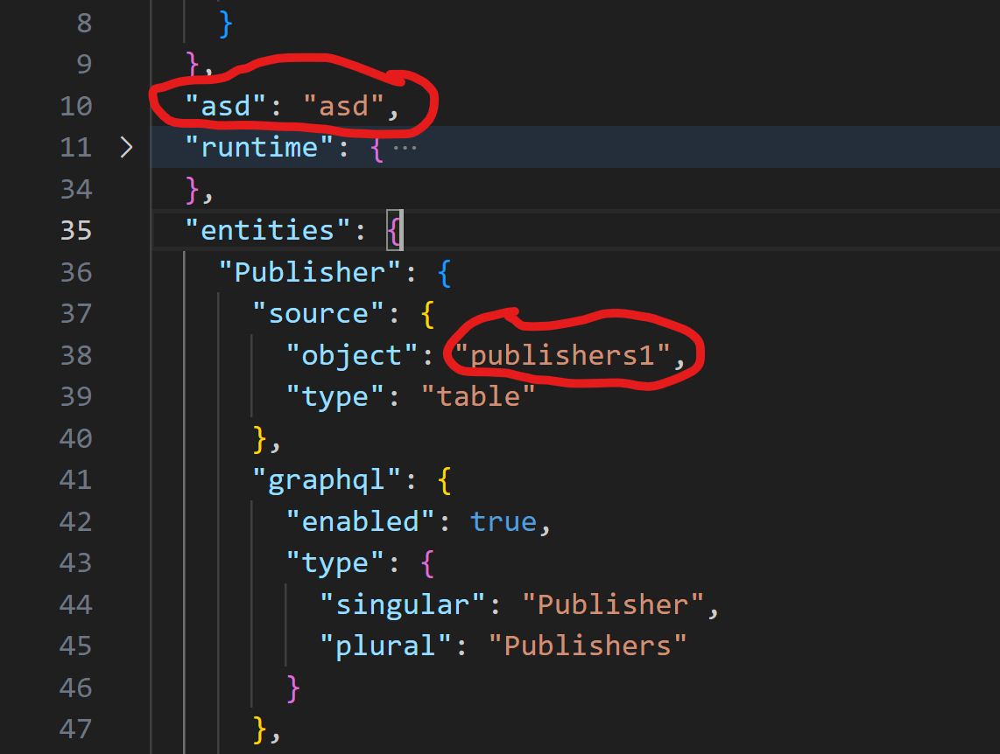
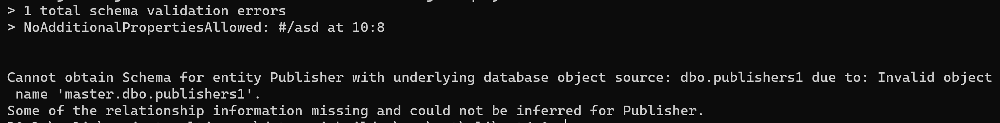

# Design Specification: Validating a Config File

## Overview

This design specification outlines the process for validating the Data API builder config file used by a runtime engine. The validation process ensures that the config file is compliant with the schema and contains all the required information for the runtime engine to function correctly.

## Types of Validations run on the config file

The following types of validations are run on the config file (in the order specified):
1. **Schema Validation**: Validates that config satisfies the schema requirements. For example, additionalProperties not defined in schema is not present in the config.
2. **Config Properties Validation**: Validates that config properties such as datasource, runtime-section are correctly defined in the config. For example, both Rest and GraphQL should not be disabled.
3. **Config permission Validation**: Validates semantic correctness of the permission defined for each entity. For example, `execute` permission is used only for stored-procedures.
4. **Database connection Validation**: Validates that a proper connection can be estabilished with the database.
5. **Entities metadata Validation**: Validates entites configuration against database. this check won't run if database connection fails. For example, checks if the specified entity is present in the DB or not.

## Design and Data Flow

1. The validation can be initiated using the CLI command `dab validate`.
2. This command will have an optional flag `-c` or `--config` to provide the config file. If not used it will pick the default config file `dab-config.{DAB_ENVIRONMENT}.json`, or `dab-config.json` if `DAB_ENVIRONMENT` is not set.
3. CLI calls the method `IsConfigValid` which returns true if config is valid, else returns false.
4. `IsConfigValid` method calls another method in the engine `TryValidateConfig()` which contains all the different methods we have for validating different parts of the config file (highlighted in [validations-types](#types-of-validations-run-on-the-config-file)).
5. We have introduced class variable called `IsValidateOnly` and `ConfigValidationExceptions` in `RuntimeConfigValidator` class.
6. Whenever the validations are trigerred by `dab validate`, It will set `IsValidateOnly=true` and it will collect Exceptions thrown in `ConfigValidationException` instead of throwing it directly.
> [NOTE] 
> Exceptions thrown in method where we cannot proceed further will be handled in a way that execution doesn't continue in the method.
> For Example: If an entity defined in the config is not present in the Database, we would not validate it's relationship information.

5. Validation Steps performed:
    - Schema Validation:
      - A new `JsonConfigSchemaValidator` class is added which uses `NJsonSchema` package to do schema validation.
      - It contains a method `Task<JsonSchemaValidationResult> ValidateJsonConfigWithSchemaAsync(string jsonSchema, string jsonData)` which runs schema validation and returns the result.
      - `jsonSchema` is obtained from the method `GetJsonSchema(RuntimeConfig runtimeConfig)`, which fetches the schema from `$schema` property if present in the config
        else fetches from the DAB package itself.
    - Config Properties Validation:
        - `ValidateConfigProperties()` method is called to run validations for Datasource, authentication options, runtime section.
        - It also validates entities do not generate duplicate queries or mutations.
    - ValidatePermissionsInConfig:
        - Validates the semantic correctness of the permissions defined for each entity within runtime configuration.
    - Validate Entity Metadata:
        - To proceed with this validation, we ensure that connection-string provided is valid.
        - Then we call the `ValidateEntitiesMetadata` method which first validates our connection to database using `ValidateDatabaseConnection` method.
        - If we are able to connect to Database, then we fetch the metadata and validate the entity and store the exceptions in the `SqlMetadataExceptions` present in SqlMetadataProvider class.
        - Once all the validation is done, we return all the metadata exception to the configValidationException which contains all the exceptions occured so far.
6. Finally, when all the validation errors are collected, we log it in the console.
7. If there are any kinds of validation errors `TryValidateConfig()` would return false, else true.

## Example

## Limitations
1. Currently the `validate` command support is limited to single datasource config file.
