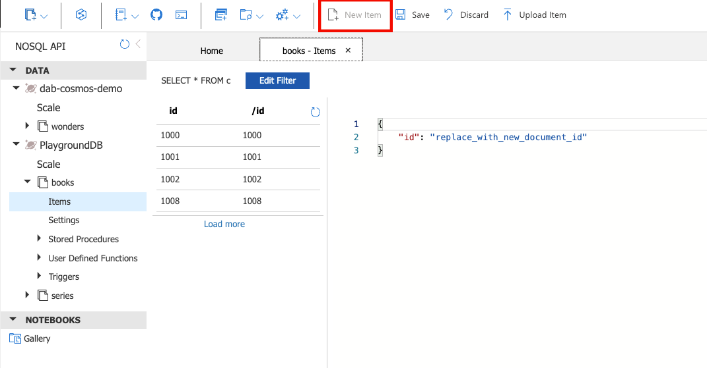
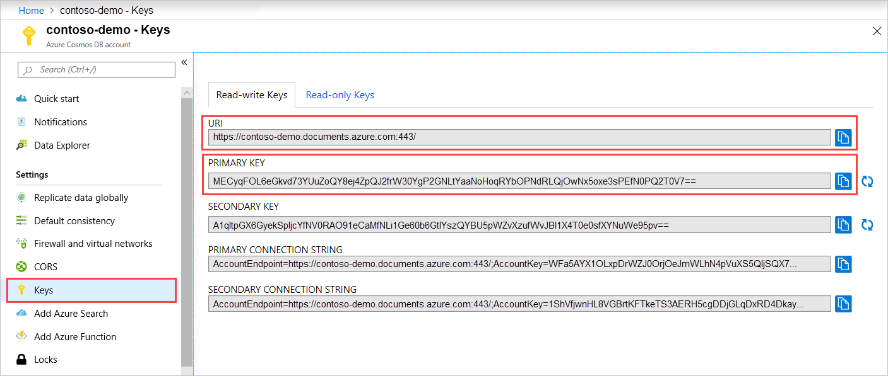

# Getting started with Data API builder for Azure Cosmos DB

Make sure you have read the [Getting Started](getting-started.md) document.

This tutorial assumes that you have already a [Cosmos DB NoSQL API database account](https://learn.microsoft.com/azure/cosmos-db/sql/create-cosmosdb-resources-portal#create-an-azure-cosmos-db-account) that can be used as a playground.

## Create the database container

Create the database container needed to represent Books. There are different ways to model this sample and you can learn more about data modeling from [here](https://learn.microsoft.com/azure/cosmos-db/nosql/modeling-data). We will use the [embedded data model](https://learn.microsoft.com/en-us/azure/cosmos-db/nosql/modeling-data#embedding-data) in this sample.

- `books`: Collection containing books and its authors with 'id' as the partition key

Read more about [choosing partition key](https://docs.microsoft.com/en-us/azure/cosmos-db/partitioning-overview#choose-partitionkey) and [data modeling](https://docs.microsoft.com/en-us/azure/cosmos-db/sql/modeling-data)

Once the container is created, we can import the sample data from `books.json` which is placed in the ['azure-cosmos-db'](../samples/getting-started/azure-cosmos-db) folder to the book collection by using the add new item option (Make sure you add one by one item) in the Azure Data Explorer.



## Add Book schema file

We need to expose the books collection so that it can be used via GraphQL. Cosmos DB, being schema agnostic, requires us to provide the schema definition for the collection. The schema definition needs to be added in the `schema.gql` file.

Start by adding the `Book` schema:

```graphql
type Book @model {
  id: ID
  title: String
  Authors: [Author]
}

type Author {
  id: ID
  first_name: String
  middle_name: String
  last_name: String
}
```

> **BEST PRACTICE**: It is recommended to use the _singular_ form for entities names. For GraphQL, the Data API builder engine will automatically use the correct plural form to generate the final GraphQL schema whenever a _list_ of entity items will be returned. More on this behavior in the [GraphQL documentation](./../graphql.md).

## Get the Cosmos DB Account connection string

You can obtain the connection string by navigating to your Azure Cosmos DB account page's key blade, and select Primary connection string. Copy the value to use in the Data API Builder.



You can also use Azure Cosmos DB emulator connection string if you are testing locally. The Azure Cosmos DB Emulator supports a [single fixed account and a well-known authentication key](https://learn.microsoft.com/en-us/azure/cosmos-db/local-emulator?tabs=ssl-netstd21#authenticate-requests)

The connection string looks like,

```
AccountEndpoint=AccountEndpoint=https://localhost:8081/;AccountKey=REPLACEME;
```

Now that you have all the required pieces in place, it's time to create the configuration file for DAB.

## Creating a configuration file for DAB

The Data API builder for Azure Databases engine needs a [configuration file](../configuration-file.md). There you'll define which database DAB connects to, and which entities are to be exposed by the API, together with their properties.

For this getting started guide you will use DAB CLI to initialize your configuration file. Run the following command:

```bash
dab init --database-type "cosmosdb_nosql" --graphql-schema schema.gql --cosmosdb_nosql-database PlaygroundDB --connection-string "AccountEndpoint=https://localhost:8081/;AccountKey=REPLACEME;" --host-mode "Development"
```

The command will generate a config file called `dab-config.json` looking like this:

```json
{
  "$schema": "dab.draft.schema.json",
  "data-source": {
    "database-type": "cosmosdb_nosql",
    "connection-string": "AccountEndpoint=https://localhost:8081/;AccountKey=REPLACEME;"
    "options": {
        "database": "PlaygroundDB",
        "schema": "schema.gql"
    }
  },
  "runtime": {
    "rest": {
      "path": "/api"
    },
    "graphql": {
      "allow-introspection": true,
      "path": "/graphql"
    },
    "host": {
      "mode": "development",
      "cors": {
        "origins": [],
        "allow-credentials": false
      },
      "authentication": {
        "provider": "StaticWebApps"
      }
    }
  },
  "entities": {}
}
```

As you can see there the `data-source` property specifies that our chosen `database-type` is `cosmosdb_nosql`, with the `connection-string` we passed to DAB CLI.

> Take a look at the [DAB Configuration File Guide](../configuration-file.md) document to learn more about the configuration file.

With the configuration file in place, then it's time to start defining which entities you want to expose via the API.

## Add Book entity

We want to expose the books collection so that it can be accessed via GraphQL. For doing that, all we need is to add the related information to the entities section of the configuration file.

> **NOTE**: REST operations are not supported for Cosmos DB via the
> Data API Builder, You can use the existing [REST API](https://learn.microsoft.com/rest/api/cosmos-db/)

You can do this either by using the CLI with the add command :

```bash
dab add Book --source books --permissions "anonymous:*"
```

or by adding the `Book` entity manually to the configuration file under entities section:

```json
    "Book": {
      "source": "books",
      "rest": false,
      "graphql": true,
      "permissions": [
        {
          "role": "anonymous",
          "actions": [ "*" ]
        }
      ]
    }
```

Within the `entities` object you can create any entity with any name (as long as it is valid for GraphQL). The name `Book`, in this case, will be used to build the GraphQL type. Within the entity you have the `source` element that specifies which container contains the entity data. In our case it is `books`.

> **NOTE**: Entity names are case sensitive and they will be exposed via GraphQL as you have typed them.

After that, you need to specify the permissions for the exposed entity, so that you can be sure only those users making a request with the right claims will be able to access the entity and its data. In this getting started tutorial we're just allowing anyone, without the need to be authenticated, to perform all the CRUD operations to the `Book` entity.

Once you have added the `Book` entity, the `entities` object of the configuration file will look like the following:

```json
 "entities": {
    "Book": {
      "source": "books",
      "rest": false,
      "graphql": true,
      "permissions": [
        {
          "role": "anonymous",
          "actions": [ "*" ]
        }
      ]
    }
  }
```

that's all is needed at the moment. Data API builder is ready to be run.

> **BEST PRACTICE**: It is recommended to use the _singular_ form for entities names. For GraphQL, the Data API builder engine will automatically use the correct plural form to generate the final GraphQL schema whenever a _list_ of entity items will be returned. More on this behaviour in the [GraphQL documentation](./../graphql.md).

## Start Data API builder for Azure Cosmos DB

Run the below command (this will start the engine with default config `dab-config.json`, use option --config otherwise):

```dos
dab start
```

Once it is successfully started, then you'll see something like:

```text
info: Azure.DataApiBuilder.Service.Startup[0]
      Successfully completed runtime initialization.
info: Microsoft.Hosting.Lifetime[14]
      Now listening on: http://localhost:5000
info: Microsoft.Hosting.Lifetime[14]
      Now listening on: https://localhost:5001
info: Microsoft.Hosting.Lifetime[0]
      Application started. Press Ctrl+C to shut down.
```

you'll be good to go, Data API Builder is up and running, ready to serve your requests.

## Query the endpoints

Now that the Data API builder engine is running, you can use your favorite REST client (Postman, Insomnia, etc.) to query the GraphQL endpoints.

### REST Endpoint

Unlike other databases, Data API Builder for Azure Cosmos DB does not support generating REST endpoints because there is already a[REST API endpoint](https://learn.microsoft.com/rest/api/cosmos-db/) capability built-in to the Azure Cosmos DB service.

### GraphQL endpoint

GraphQL endpoint is available at

```text
/graphql
```

Use a GraphQL-capable REST client like Postman or Insomnia to query the database using full GraphQL introspection capabilities and to get IntelliSense and validation. For example:

```graphql
{
  books(first: 5, orderBy: { title: DESC }) {
    items {
      id
      title
    }
  }
}
```

will return the first five books ordered by title in descending order.

## GraphQL operations on entity relationships

With your GraphQL endpoint operational, you probably want to take advantage of GraphQL's ability to handle complex requests.For example, you may want to get all the Books in your library along with the Authors they have written. In order to achieve that, you need to let Data API Builder know that you want that relationship to be available to be used in queries. We have defined the
data models in such a way that they can be queried at once.

Using GraphQL you can now execute queries like:

```graphql
{
  books(filter: { title: { eq: "Foundation" } }) {
    items {
      id
      title
      Authors {
        first_name
        last_name
      }
    }
  }
}
```

This query will return list of Books and its Authors.

Congratulations, you have just created a fully working backend to support your modern applications!

## Exercise

If you want to practice what you have learned, here's a little exercise you can do on your own

- Add the collection `series` which will store series names (for example: [Foundation Series](https://en.wikipedia.org/wiki/Foundation_series)) and respective ids.
- Update the `books` collection by adding a field named `series_id` and update with matching series_id.
- Update the configuration file with a new entity named `Series`, supported by the `series` source collection you just created.
