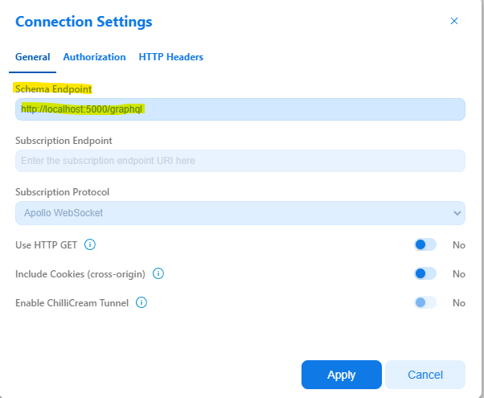

# Introduction

This document provides instruction for running the engine inside a Docker container.

## Running docker container from ACR (Prebuilt image)

N.B. If you want to build your own image, use the next section (Build and deploy as Docker Container)

N.B. You might not have access to the container registry where the image is hosted. Reach out to someone on the team to get access.

1. You will need to login to the ACR:

```bash
az acr login --name hawaiiacr
```

2. Update the configuration files for your environment:

Update `dab-config.json` (and `schema.gql` if using cosmos).

3. Choose a `docker-compose-*.yml` file based on your environment (cosmos, sql, postgres)

    3.1. Open the docker-compose file and update the `image` with the tag you want to use. The `latest` tag has the latest commit.
        To find a different tag, find the CI run that was automatically triggered after your checkin, view more details on azure pipelines, then click `Job`.
        In the logs of `Build and push docker image` stage, search for `docker push` to find the tag that was pushed.

    3.2. If you are not using the configuration from the repo, update the path to your config/schema to point to your files and map them to `/App/dab-config.json` and for cosmos - `/App/schema.gql` as well.

    3.3. Run docker compose up to start the container:

```bash
docker compose -f "../../docker/docker-compose.yml" up
```

4. Your container should be accessible at `http://localhost:5000`. 

    4.1 Append the `path` from the `runtime` section of configuration file to access the respective GraphQL or REST endpoint URI.
    e.g. if you are using the configuration example from this repo, GraphQL endpoint URI will be `http://localhost:5000/graphql`
    whereas one of the REST endpoint URIs will be `http://localhost:5000/api/Book`.

    4.2 Use your favorite client like Banana Cake Pop(for GraphQL) or Post Man(for both GraphQL and REST) to trigger
    the requests. In Banana Cake Pop, make sure to configure the schema endpoint to the GraphQL endpoint
    e.g.`http://localhost:5000/graphql` in its `Connection Settings`-> `General` tab.

    

## Build and deploy as Docker Container

If you want to build your own docker image, follow these instructions.

N.B. Ensure you have docker running, with Linux containers chosen.

1. Navigate to the root folder of the repo.
2. Run docker build. If you are on Windows, you need to do this in a WSL terminal.

```bash
docker build -t hawaii:<yourTag> -f ../../docker/Dockerfile .
```

3. To run a container with the image you created, follow the instructions above (Running docker container from ACR (Prebuilt image)). Make sure to replace the image in the docker-compose file with the one you built. You can skip the login step.

### Deploying the Container

If you are planning to deploy the container on Azure App service or elsewhere, you should deploy the image to an ACR.
In the following example we are using `hawaiiacr.azurecr.io/hawaii` ACR, but you can use any other ACR to which have access to.

N.B. We automatically push images to the ACR on every CI build, so if you open a PR, it will generate an image with your changes and push it to the ACR automatically.

1. Update your image tag.

```bash
docker tag hawaii:<yourTag> hawaiiacr.azurecr.io/hawaii/<yourBranch>:<yourTag>
```

Choose something meaningful when tagging your images. This will make it easier to understand what each image is.
For example, on a user branch, one could use the branch name with the commit id (or a date).

```bash
docker tag hawaii hawaiiacr.azurecr.io/hawaii/docker-registry:a046756c97d49347d0fc8584ecc5050029ed5840
```

2. Login to the ACR with the correct credentials

```bash
az acr login --name hawaiiacr
```

3. Push the image

```bash
docker push hawaiiacr.azurecr.io/hawaii/<yourBranch>:<yourTag>
```

## Managing the Pipeline

The pipeline has permissions to push to this ACR through this service connection in ADO: <https://msdata.visualstudio.com/CosmosDB/_settings/adminservices?resourceId=6565800e-5e71-4e19-a610-6013655382b5>.

To push to a different container registry, we need to add a new service connection to the registry and modify the docker task in the build-pipeline.yml file to point to the new registry.
