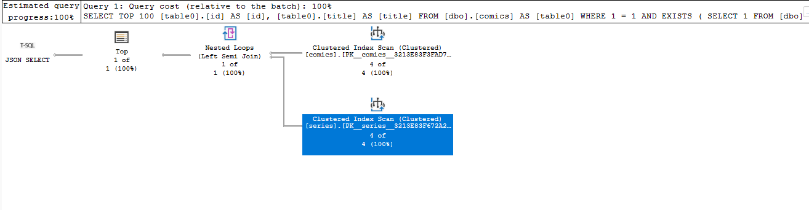
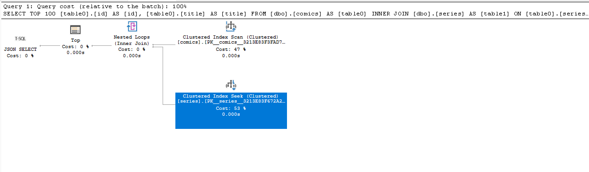

# Nested Filtering

## Scope
This doc describes the design and high level implementation details of nested filtering for SQL databases.

## What does nested filtering mean?
When two entities are related to each other, the capability to filter rows of one entity based on the values of the related entity is termed as nested filtering.

For an example configuration:
```json
    "Comic": {
      "source": "comics",
    ...
      "relationships": {
        "myseries": {
          "cardinality": "one",
          "target.entity": "series"
        }
      }
    },
    "series": {
      "source": "series",
    ...
      "relationships": {
        "comics": {
          "cardinality": "many",
          "target.entity": "Comic"
        }
      }
```

the following is a nested filter query that tries to obtain those comics that have the name of their `series` set to `Foundation`:
```graphql
{
    comics (filter: { myseries: { name: { eq: "Foundation" }}} ){
    items {
      id
      title
    }
  }
}
```

## Why do we need nested filtering?
A GraphQL client application needs to retrieve more data and then apply a filter in the client side in order to get the same results as the nested filtering query returns. 
For the above example, without nested filtering, the client has to query all the comics with myseries first, only to discard the rows where myseries.name = `Foundation`
```graphql
{
    comics {
    items {
      id
      title
      myseries {
        name
      }
    }
  }
}
```

Nested Filtering is useful to minimize the amount of data that is transferred as response from the backend.

## How to achieve nested filtering? 
1. Have a GraphQL Schema that allows filtering arguments which represent filter inputs of related entities.
    We already fulfill this requirement by providing such arguments for each of the related entities.
    For the above example, we already create the `ComicFilterInput` like:

    ```graphql
        """
    Filter input for Comic GraphQL type
    """
    input ComicFilterInput {
    id: IntFilterInput
    title: StringFilterInput
    volume: IntFilterInput
    categoryName: StringFilterInput
    series_id: IntFilterInput

    """
    Filter options for myseries
    """
    myseries: seriesFilterInput

    and: [ComicFilterInput]
    or: [ComicFilterInput]
    }
    ```

2. Generate the correct SQL query for the GraphQL nested filter.
    - MsSql
    For Azure SQL, the corresponding SQL query for the above example is:

    Option 1: Using `EXISTS` Clause
    ```sql
    SELECT 
    TOP 100 [table0].[id] AS [id], 
    [table0].[title] AS [title]
    FROM 
    [dbo].[comics] AS [table0]
    WHERE 
    1 = 1
    AND EXISTS (
        SELECT 1
        FROM [dbo].[series] AS [table1]
        WHERE [table1].[name] = 'Foundation'
        AND [table0].[series_id] = [table1].[id]
    )
    ORDER BY 
    [table0].[id] ASC FOR JSON PATH, 
    INCLUDE_NULL_VALUES
    ```

    Notice, it has the `EXISTS` clause with a subquery in it(that represents the related entity whose values are to be used to do the filtering)
    where we do a join with the outer query(that represents the parent entity whose rows are to be filtered) so that the filtering happens only on the related rows. For example, above, we add an `EXISTS` clause for the `series` subquery joined with the `comics` table from the outer query.
    All additional predicates related to `series` are moved into the subquery.

    The plan seen for this query with `EXISTS` clause looks like:
    

    Option 2: Using `INNER JOIN`
    ```sql
    SELECT 
    TOP 100 [table0].[id] AS [id], 
    [table0].[title] AS [title]
    FROM 
    [dbo].[comics] AS [table0]
    INNER JOIN 
      [dbo].[series] AS [table1] ON 
      [table0].[series_id] = [table1].[id]
      AND [table1].[name] = 'Foundation'
    WHERE 
    1 = 1
    ORDER BY 
    [table0].[id] ASC FOR JSON PATH, 
    INCLUDE_NULL_VALUES
    ```

    In this query, we perform an INNER JOIN between the parent entity and each of the entities representing the nested filter with any additional predicates applied to the join itself. For example, `series` is inner joined with `comics` and the predicate on `series` is added to the join clause.


    The plan seen for this inner join query looks like:
    

As you can see, there are two scans involved in option 1 with `EXISTS` subquery whereas option 2 with `INNER JOIN` involves one scan and one seek. 

Although scans are costlier than seeks, they are not always bad. The option 2 is only valid when the cardinality of the relationship is one:one. In case of many-* relationships, we need to tweak the query to include DISTINCT and GROUP BY clauses for accurate results. Due to this added complexity, we choose option 1.

    ```sql
    SELECT DISTINCT
    TOP 100 [table0].[id] AS [id], 
    [table0].[title] AS [title]
    FROM 
    [dbo].[comics] AS [table0]
    INNER JOIN 
      [dbo].[series] AS [table1] ON 
      [table0].[series_id] = [table1].[id]
      AND [table1].[name] = 'Foundation'
    WHERE 
    1 = 1
    GROUP BY [table0].[id]
    ORDER BY 
    [table0].[id] ASC FOR JSON PATH, 
    INCLUDE_NULL_VALUES
    ```


## Implementation Details for Option 1 Exists clause
- When we parse the GraphQL filter arguments, we can identify if it is a nested filter object when the type of filter input is not a scalar i.e. NOT any of String, Boolean, Integer or Id filter input.
- Once the nested filtering scenario is identified, we need to identify if it is a relational database(SQL) scenario or non-relational. If the source definition of the entity that is being filtered has non-zero primary key count, it is a SQL scenario.
- Create an SqlExistsQueryStructure as the predicate operand of Exists predicate. This query structure has no order by, no limit and selects 1.
- Its predicates are obtained from recursively parsing the nested filter and an additional predicate to reflect the join between main query and this exists subquery.
- Recursively parse and obtain the predicates for the Exists clause subquery
- Add JoinPredicates to the subquery query structure so a predicate connecting the outer table is added to the where clause of subquery
- Create a new unary Exists Predicate and chain it with rest of the existing predicates, then continue with rest of the filter predicates.
- Handle Exist clause while Building each of the Predicates.
- Build the Exists predicate subquery using the overloaded function Build for `SqlExistsQueryStructure` to take the form: 
`SELECT 1 FROM <nestedsourcename> WHERE <predicates> AND <parent_pk> = <nestedsource_pk>` The join predicates will be different based on the kind of relationship
and might involve an inner join if there is an associative table.

## Implementation for Option 2 Inner Join (Not chosen)
- When we parse the GraphQL filter arguments, we can identify if it is a nested filter object when the type of filter input is not a scalar i.e. NOT any of String, Boolean, Integer or Id filter input. 
- Once the nested filtering scenario is identified, we need to identify if it is a relational database(SQL) scenario or non-relational. If the source definition of the entity that is being filtered has non-zero primary key count, it is a SQL scenario. 
- Create a `SqlJoinStructure` for the nested filter object e.g. `series` so as to join with the parent entity - `comics`. The join predicate will be equality of primary keys of the nested and parent entities.
- Add this `SqlJoinStructure` to the `Joins` list property of the `SqlQueryStructure` representing the parent (`comics`).
- Recursively parse and obtain the predicates on the nested filter object while passing the original `Joins` property to subsequent recursive calls.
- All additional scalar predicates obtained from recursively parsing the nested filter object are added to the `SqlJoinStructure` corresponding to that nested filter.
- Create `SqlJoinStructure` for each subsequent recursive nested filter with join predicates between the caller and the called entities. For example, if `series` were to be further filtered based on its related `author` entity, we would create the `SqlJoinStructure` for `author` with join predicates between primary key of `series` and `author`. However, we add this `SqlJoinStructure` to the same `Joins` property of the original parent entity that is passed down. This flattens all the inner joins and all the additional scalar predicates are appropriately added to the correct `SqlJoinStructure`.
- Continue with rest of the filters on the parent entity and eventually return a chain of predicates from the filter parser. If there were only nested filters, we wouldn't see any additional `WHERE` clause predicates - only joins.
- Build the join clause while building the original query structure with `INNER JOIN`s for each of the `SqlJoinStructure`s in the `Joins` list property.
