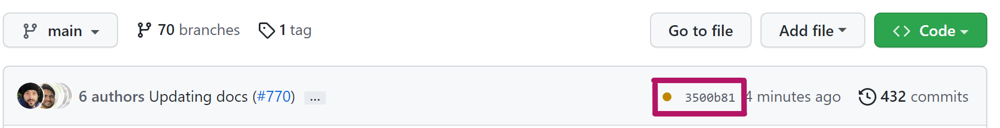
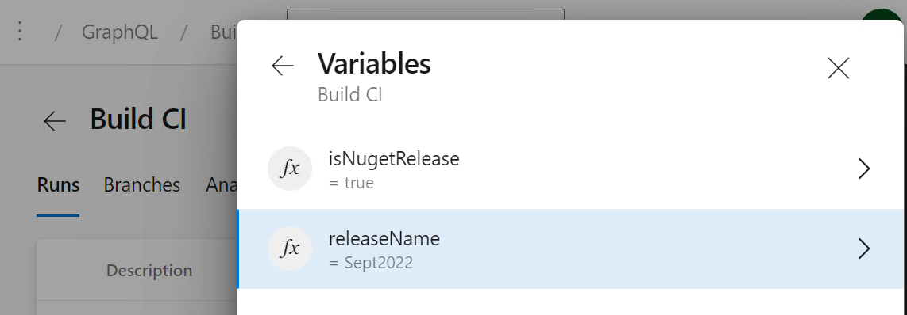
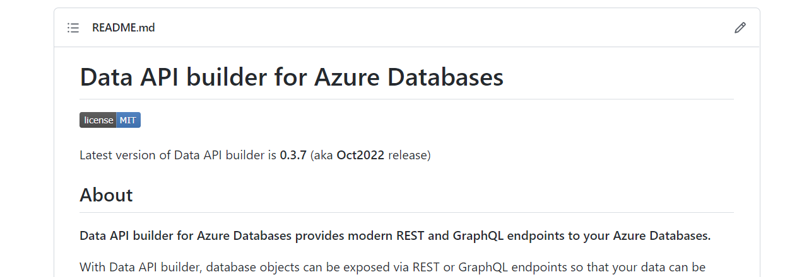
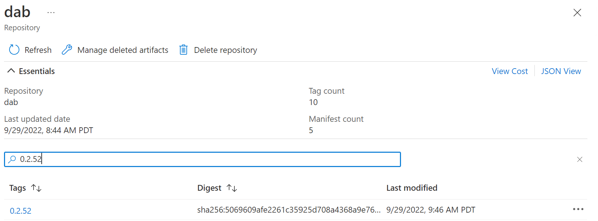
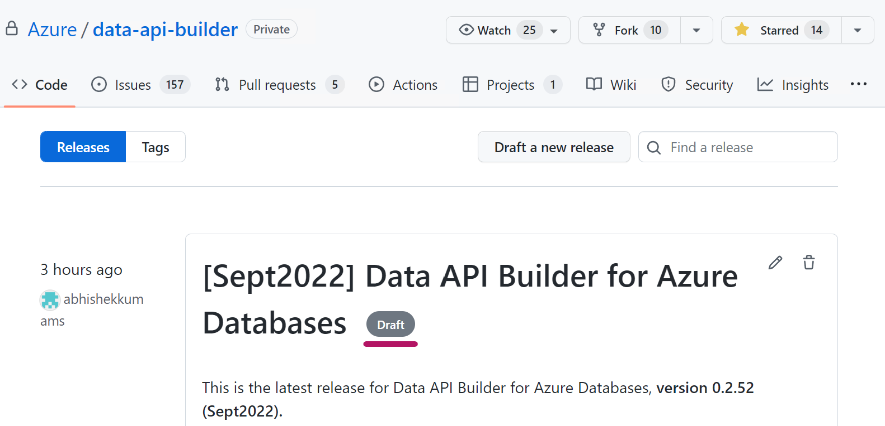
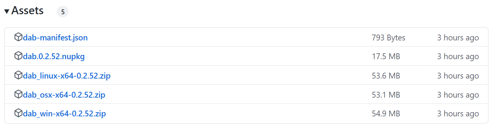
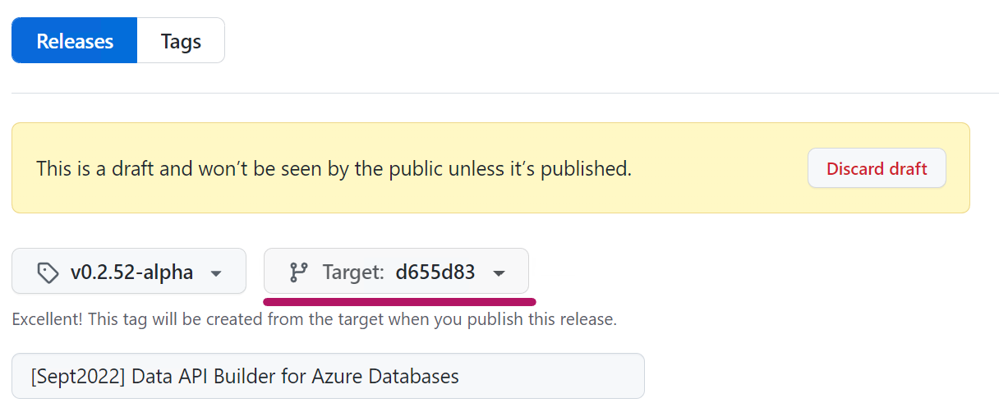

# Release Checklist

## Pre-Build Tasks

- [ ] Make sure that the rolling build after the latest desired commit required for the release is green. You can do so by navigating to the root of the repo in GitHub to check the commit banner for successful pipeline execution: 
- [ ] Create a new branch `release/MonthNameYear` where MonthNameYear matches the milestone name, e.g. `Oct2022` The version number for this release will be the current major.minor numbers as in the `main` branch. The patch number will be the final build number that will be used to generate the binaries to be released.
- [ ] After creating the release branch, increase the value of the `minor` variable in `.pipelines/build-pipelines.yml` and open a pull request on `main` with the update. This update to the minor version number can be reviewed and merged asychronously from the release so you may continue on to the next checklist items.
- [ ] Trigger a release [build](https://msdata.visualstudio.com/CosmosDB/_build?definitionId=18014) targeting the newly created branch by setting the pipeline variables `isNugetRelease` to `true` and `releaseName` to `MonthNameYear`. 

## Post-Build Tasks

After a successful build, complete the following steps:

### Update documentation

- [ ] Make sure that all new/updated features are well documented. If new documentation pages were created, make sure to update the [main TOC](../readme.md) in the `docs` folder.

- [ ] Make sure that the [main README](../../README.md), in the root folder is updated to show the latest release number and name. 

### CLI Nuget Package Published

- [ ] Verify the [nuget feed](https://msdata.visualstudio.com/CosmosDB/_artifacts/feed/DataApiBuilder) is updated with the desired release version for the `dab` package. Download the nuget and do some smoke tests following the instructions [here.](../getting-started/getting-started-dab-cli.md)

### Docker Image Published

- [ ] Verify that a new image tagged with `MonthNameYear` and a matching `BuildDate-Build.SourceVersion` tag exists in the [`dab`](https://ms.portal.azure.com/#view/Microsoft_Azure_ContainerRegistries/RepositoryBlade/id/%2Fsubscriptions%2Fb9c77f10-b438-4c32-9819-eef8a654e478%2FresourceGroups%2Fhawaii-demo-rg%2Fproviders%2FMicrosoft.ContainerRegistry%2Fregistries%2Fhawaiiacr/repository/dab) repository within the [`hawaiiacr`](https://ms.portal.azure.com/#@microsoft.onmicrosoft.com/resource/subscriptions/b9c77f10-b438-4c32-9819-eef8a654e478/resourceGroups/hawaii-demo-rg/providers/Microsoft.ContainerRegistry/registries/hawaiiacr/repository) container registry.

  - Follow the instructions at [GettingStartedWithDocker.md](GetStartedWithDocker.md) and smoke test the docker scenario.
  
### GitHub Release Creation and Publishing

- [ ] Verify that a new [Draft Release](https://github.com/Azure/data-api-builder/releases) was automatically created.

- [ ] Verify that the new Draft Release contains all project assets and that the assets are tagged with a versionID such as `0.2.52`.:
  - NuGet package
  - Manifest file
  - Zip files for all the 3 OS platforms. 
  
- [ ] Go to the GitHub [release page](https://github.com/Azure/data-api-builder/releases), select the draft release, and do the following:
  - Check that the **Target** branch hash matches that of the latest release branch commit hash.
  
  - Provide a description to the release. This list is arbitrary and a good source of content can be sourced from PRs included in this release. **Make sure to reference the PR for each item.**
  - Publish the release.

## Guidelines for versioning

- Major – incremented to 1 when we do a public release. Currently it is zero. Any releases not backwards compatible should result in a major version number increment.
- Minor – Incremented every time we do a snap (e.g. creating a branch for a monthly release).
- Patch – Automatically set by the pipeline
