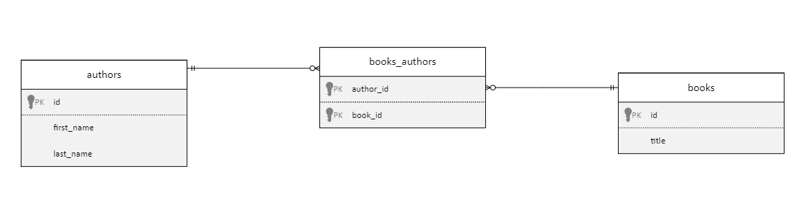

# Relationships

GraphQL queries can traverse related objects and their fields, so that with just one query you can write something like:

```graphql
{
  books
  {
    items {
      id
      title    
      authors {
        items {
          first_name
          last_name
        }
      }
    }
  }
}
```

to retrieve books and their authors.

To allow this ability to work, Data API Builder needs to know how the two objects are related to each other. The `relationships` section in the configuration file provide the necessary metadata for making this ability working correctly and efficiently.

## Configuring a Relationship

No matter what database you are using with Data API Builder, you have to explicitly tell Data API Builder that an object is related to another one even if, using Foreign Key metadata when available, it could infer it automatically. This is done to allow you to have full control on what is exposed via GraphQL and what not.

There are three types of relationship that can be established between two entities:

- [One-to-Many Relationship](#one-to-many-relationship)
- [Many-to-One Relationship](#many-to-one-relationship)
- [Many-to-Many Relationship](#many-to-many-relationship)

### One-to-Many Relationship

A one-to-many relationship allows an object to access a list of related objects. For example a books series can allow access to all the books in that series:

```graphql
{
  series {
    items {
      name
      books {
        items {
          title
        }
      }
    }
  }
}
```

If there are Foreign Key supporting the relationship between the two underlying database objects, you only need to tell Data API Builder, that you want to expose such relationship. With DAB CLI:

```bash
dab update series --relationship books --target.entity book --cardinality many 
```

which will update the `series` entity - used in the example - to look like the following:

```json
"series": {
  "source": "dbo.series",
  ...
  "relationships": {
    "books": {
      "target.entity": "book",
      "cardinality": "many"    
    }
  }
  ...
}
```

A new key has been added under the `relationships` element: `books`. The element defines the name that will be used for GraphQL field to navigate from the series object to the object defined in the `target.entity`, `book` in this case. This means that there must be an entity called `book` in configuration file.

`cardinality` property tells Data API Builder that there can be many books in each series, so the created GraphQL field will return a list of items.

That's all you need. At startup Data API Builder will automatically detect the database fields that needs to be used to sustain the defined relationship.

If you don't have a Foreign Key constraint sustaining the database relationship, Data API Builder cannot figure out automatically what fields will be used to relate the two entities, so you have to provide it manually. You can do it with DAB CLI:

```bash
dab update series --relationship books --target.entity book --cardinality many  --relationship.fields "id:series_id"
```

The option `relationship.fields` allows you to define which fields will be used from the entity being updated, `series` in the sample, and which fields will be used from the target entity, `book` in the sample, to connect the data from one entity to the other.

In the above sample, the `id` database field of the `series` entity will be matched with the database field `series_id` of the `book` entity.

The configuration will also contain that information:

```json
"series": {
  "source": "dbo.series",
  ...
  "relationships": {
    "books": {
      "cardinality": "many",
      "target.entity": "book",
      "source.fields": ["id"],
      "target.fields": ["series_id"]
    }    
  }
  ...
}
```

### Many-to-One Relationship

A many to one relationship is similar to the One-To-Many relationship with two major differences:

- the `cardinality` is set to `one`
- the created GraphQL field will return a scalar not a list

Following the Book Series samples used before, a book can be in just one series, so the relationship will be created using the following DAB CLI command:

```bash
dab update book --relationship series --target.entity series --cardinality one
```

which will generate the following configuration:

```json
"book": {
  "source": "dbo.books",
  ...
  "relationships": {       
    "series": {
      "target.entity": "series",
      "cardinality": "one"
    }
  }
}
```

which, in turn, will allow a GraphQL query like the following:

```graphql
{
  books {
    items {
      id
      title    
      series {
        name
      }
    }
  }
}
```

where each book will return also the series it belongs to.

### Many-To-Many Relationship

Many to many relationships can be seen as a pair of One-to-Many and Many-to-One relationships working together. An author can surely write more than one book (a One-to-Many relationship), but is also true than more than one author can work on the same book (a Many-to-One relationship).

Data API builder support this type of relationship natively:

- the cardinality of both entities participating in the Many-to-Many relationship must be set to `many`
- for relational databases a linking object or entity must be provided

#### Using a linking object

In relational databases Many-to-Many relationships are created using an third table that *links* the tables participating in the Many-to-Many relationship together:



In the diagram above you can see that there is a table named `books_authors` that is linking authors with their books and books with their authors. This linking table doesn't need to be exposed to the end user as it is just an artifact to allow the Many-to-Many relationship to exists, but Data API builder needs to know its existence in order to properly use it.

DAB CLI can be used to create the Many-to-Many relationship and also configure the linking object:

```bash
dab update book --relationship authors --target.entity author --cardinality many --relationship.fields "id:id" --linking.object "dbo.books_authors" --linking.source.fields "book_id" --linking.target.fields "author_id" 
```

which will update the JSON configuration file to be like the following:

```json
"book": {
  "source": "dbo.books",
  ...
  "relationships": {       
    "authors": {
      "cardinality": "many",
      "target.entity": "author",
      "source.fields": [ "id" ],
      "target.fields": [ "id" ],
      "linking.object": "dbo.books_authors",
      "linking.source.fields": [ "book_id" ],
      "linking.target.fields": [ "author_id" ]
    }
  }
}
```

the configuration is telling DAB that you want to add a field in the `book` entity that will allow access to books `authors`. `authors` can be `many`, so a list of authors will be returned when the GraphQL query will access the `authors` field. This relationship defines how to navigate *from* books *to* authors, so the database fields used to navigate from books to their authors are defined in the `source.fields` for the book, and in the `target.fields` for the authors, similarly to the One-to-Many or Many-to-One relationship described above.

This is a Many-to-Many relationship, so there is no direct connection between the two entities and so a `linking.object` needs to be used. In the sample the database table `dbo.books_authors` is used as the linking object. How the linking object is able to connect books to their authors is defined in the `linking.source.fields` and `linking.target.fields` properties. The first one tells DAB how the source entity - the `book` is connected to the liking object, and the second one how to linking object is connected to the target entity, `author` in the sample.

To understand how the provided information are used, you can visualize the equivalent query that you would have written:

```sql
select * 
from dbo.books as b
inner join dbo.books_authors as ba on b.id = ba.book_id 
inner join dbo.authors a on ba.author_id = a.id 
```

with the provided configuration DAB will now be able to understand GraphQL like the following:

```graphql
{
  books {
    items {
      id
      title
      authors {
        items {
          first_name
          last_name
        }
      }
    }
  }
}
```

where you want to get books and their authors.

To allow navigation from `authors` to `book`, the same principles can be applied, updating the configuration using the following command:

```bash
dab update author --relationship books --target.entity book --cardinality many --relationship.fields "id:id" --linking.object "dbo.books_authors" --linking.source.fields "author_id" --linking.target.fields "book_id" 
```

which will define a Many-to-Many relationship between the `author` entity and the `book` entity, using the linking object `dbo.books_authors` behind the scenes.

#### Using a linking entity

WIP