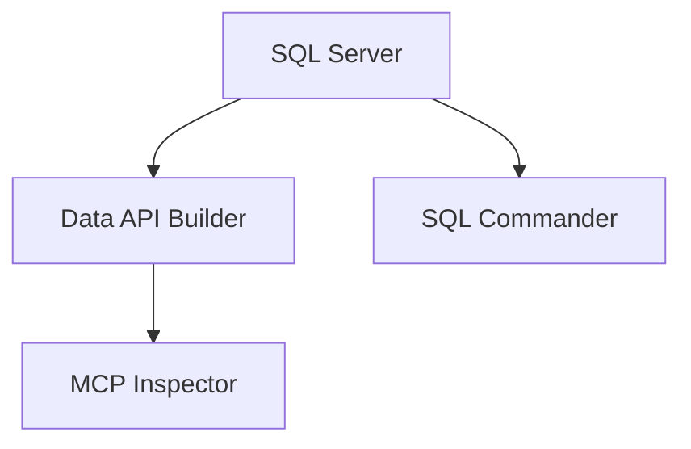
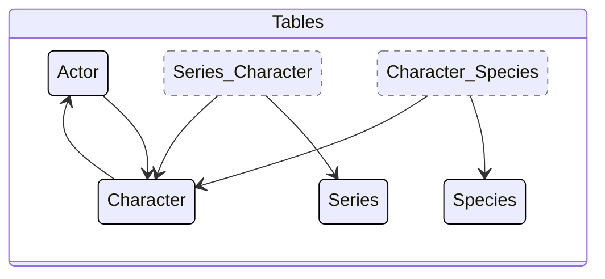

# Sample: Data API builder in Aspire

This sample demonstrates running Data API builder with MCP (Model Context Protocol) support using Aspire orchestration.

## Running Options

### Option 1: Using Aspire CLI (Recommended)

To run this sample, install the prerequisites, then execute the following command in this directory:

```sh
> aspire run
```

**Prerequisites:**
 - Dotnet CLI v10+ [Install](https://dotnet.microsoft.com/en-us/download/dotnet) Verify with `dotnet --version`
 - Aspire CLI v13+ [Install](https://aspire.dev/get-started/install-cli/) Verify with `aspire --version`
 - Docker Desktop (running) [Install](https://www.docker.com/products/docker-desktop/)

### Option 2: Running Manually Without Aspire CLI

If you prefer to run DAB manually or don't have the Aspire CLI installed, see:
- **[RUNNING_DAB_MANUALLY.md](RUNNING_DAB_MANUALLY.md)** - Step-by-step guide for running DAB directly with Docker SQL Server
- **[DEMONSTRATION_SUMMARY.md](DEMONSTRATION_SUMMARY.md)** - Complete demonstration results with MCP test examples

## Resources



## Files

- [`apphost.cs`](apphost.cs) - Single-page [Aspire orchestration](https://learn.microsoft.com/en-us/dotnet/aspire/app-host/configuration)
- [`database.sql`](database.sql) - Basic Star Trek schema & seed data
- [`dab-config.json`](dab-config.json) - Standard DAB configuration file
- [`dab-config.cmd`](dab-config.cmd) - [CLI commands](https://learn.microsoft.com/en-us/azure/data-api-builder/command-line/) to create `dab-config.json` (reference only)
- [`global.json`](global.json) - .NET SDK version settings

## Data structures

This schema demonstrates all of the relationship cardinalities.


