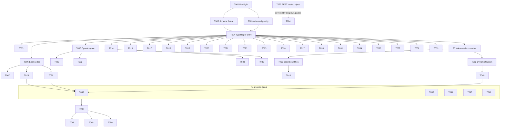

# Tasks: MSSQL JSON Data Type Support

**Feature**: 001-mssql-json-type | **Branch**: `Usr/sogh/speckit-jsontypesupport`
**Input**: [plan.md](./plan.md), [spec.md](./spec.md), [research.md](./research.md), [data-model.md](./data-model.md), [contracts/](./contracts/), [quickstart.md](./quickstart.md)

**Tests obligation**: Constitution Principle II requires integration tests
under `TestCategory=MsSql` for every behavior change. Tests below are
therefore **required**, not optional.

## Format

`- [ ] [TaskID] [P?] [Story?] Description with file path`

- **[P]** — parallelizable: distinct files, no unfinished dependency.
- **[USn]** — user-story tag for tasks that implement / verify user stories US1–US9. Foundational, infrastructure, regression-guard, and polish tasks carry no story tag.

## Upstream Dependency — **NOT in this task list**

`Microsoft.Data.SqlClient >= 6.0.0` (and its companion edits to
`src/Directory.Packages.props`, `external_licenses/`, and
`scripts/notice-generation.ps1`) is delivered by a **separate
prerequisite PR**. Per [plan.md §Upstream Dependency](./plan.md), tasks
in this file MUST NOT touch those three files. The very first task (T001)
verifies the prerequisite is in place and fails fast if not.

---

## Phase 1: Pre-flight (Blocking)

**Purpose**: Confirm the upstream prerequisite PR has landed before any
code in this feature is written. Read-only — modifies no source files.

- [ ] T001 Verify `Microsoft.Data.SqlClient >= 6.0.0` in [src/Directory.Packages.props](../../src/Directory.Packages.props) (read-only assertion; e.g., grep for `<PackageVersion Include="Microsoft.Data.SqlClient"` and confirm version >= 6.0.0). Verify `SqlDbType.Json` resolves at compile time by adding a one-line scratch build probe (then removing it) or by inspecting the SqlClient assembly via `dotnet list package`. **If absent, halt and link to the prerequisite dependency PR.** MUST NOT modify [src/Directory.Packages.props](../../src/Directory.Packages.props), `external_licenses/`, or [scripts/notice-generation.ps1](../../scripts/notice-generation.ps1).

**Checkpoint**: Prerequisite confirmed. Implementation may begin.

---

## Phase 2: Foundational test fixtures (Blocking)

**Purpose**: Create the `Profile`/`profiles` test fixture so subsequent
integration tests have a database table and DAB entity to bind to. With
these in place, all integration tests added later in this plan can be
authored in their final form (initially red, going green as the code
edits land in Phases 3–6).

- [ ] T002 Add the `profiles` table and the 5 seed rows defined in [data-model.md](./data-model.md) §Table Definition to [src/Service.Tests/DatabaseSchema-MsSql.sql](../../src/Service.Tests/DatabaseSchema-MsSql.sql). Format per copilot-instructions.md MSSQL rules (poorsql, 4-space indent, trailing commas). **MUST NOT touch** `DatabaseSchema-PostgreSql.sql`, `DatabaseSchema-MySql.sql`, `DatabaseSchema-DwSql.sql`, or any CosmosDB schema file (FR-012, Principle I).
- [ ] T003 Add the `Profile` entity entry to [src/Service.Tests/dab-config.MsSql.json](../../src/Service.Tests/dab-config.MsSql.json) (source object `dbo.profiles`, anonymous read role for tests as per existing fixture patterns), per [data-model.md](./data-model.md) §DAB Entity. Run `dab validate` against the updated config (no `schemas/dab.draft.schema.json` change expected per FR-014 / R11).

**Checkpoint**: Test fixture exists; integration test files added in later phases will resolve their entity references. No production behavior change yet.

---

## Phase 3: Type-mapping foundation

**Purpose**: Map `SqlDbType.Json` through the existing string pipeline
(R1, R2). Single-line dictionary edit; happy-path reads then begin
returning JSON columns as strings end-to-end.

- [ ] T004 Add `[SqlDbType.Json] = typeof(string)` to `TypeHelper._sqlDbTypeToType` in [src/Core/Services/TypeHelper.cs](../../src/Core/Services/TypeHelper.cs) (R1). Position the entry adjacent to the existing `NVarChar`/`Text` entries to keep the dictionary readable.
- [ ] T005 [P] Unit test: extend the `TypeHelper` test suite (under [src/Service.Tests](../../src/Service.Tests)) to assert `GetSystemTypeFromSqlDbType("json")` returns `typeof(string)` and that `GetJsonDataTypeFromSystemType(typeof(string))` continues to return `JsonDataType.String` (regression check for R2).

**Checkpoint**: Once T004 is merged, `MsSqlMetadataProvider.SqlToCLRType` resolves JSON columns; `OpenApiDocumentor` and `SchemaConverter` emit `string` / `String` automatically. Phase 6's US1 integration tests transition from red to green.

---

## Phase 4: Error mapping (SQL JSON syntax → 400 / BAD_REQUEST)

**Purpose**: Map SQL Server JSON-validation error numbers to
`HttpStatusCode.BadRequest`, satisfying FR-007 and SC-004 (no 5xx
leakage). R4.

- [ ] T006 Extend `MsSqlDbExceptionParser.BadRequestExceptionCodes` in [src/Core/Resolvers/MsSqlDbExceptionParser.cs](../../src/Core/Resolvers/MsSqlDbExceptionParser.cs) to include `{13608, 13609, 13610, 13611, 13612, 13613, 13614}`. Prune to the verified set during implementation via the integration tests in T020 (R4 instructs verifying the exact set against the target SQL Server 2025 build).
- [ ] T007 [P] Unit test: add a `MsSqlDbExceptionParserTests` case (under [src/Service.Tests](../../src/Service.Tests)) asserting that a `SqlException` carrying `Number = 13608` (and at least one neighbor in the 13609–13614 range) maps to `HttpStatusCode.BadRequest` via `GetHttpStatusCodeForException`, while a still-unknown number maps to its prior status (regression). Uses the existing `MakeSqlException`-style helper if present, else mocks `SqlException` via reflection per existing test patterns.

**Checkpoint**: Once T006 lands, malformed-JSON writes return 400 (REST) and `BAD_REQUEST` (GraphQL via the standard DAB exception → GraphQL error translation). T026 (FR-007 integration tests) goes green.

---

## Phase 5: Operator allow-list gate (JSON `$filter`)

**Purpose**: Reject every `$filter` operator on JSON columns other than
`eq`/`ne` (including null checks) with a 400 before SQL is generated.
Single shared gate covers REST and GraphQL. R3.

- [ ] T008 Inside `ODataASTVisitor.PopulateDbTypeForProperty` in [src/Core/Parsers/ODataASTVisitor.cs](../../src/Core/Parsers/ODataASTVisitor.cs), after `SqlDbType` is resolved for the property, add the JSON-column operator gate: if `SqlDbType == SqlDbType.Json` and the surrounding `BinaryOperatorNode.OperatorKind` is not `Equal` or `NotEqual`, throw `DataApiBuilderException` with `HttpStatusCode.BadRequest` and sub-status `BadRequest`. Message MUST identify the offending operator and the column name (per FR-009). Plumb the operator-kind into the gate via the smallest change consistent with the existing visitor flow (see R3 "Refinement").
- [ ] T009 [P] Unit test: add `ODataASTVisitorTests` cases (under [src/Service.Tests](../../src/Service.Tests)) covering, for a fixture column whose `SqlDbType` is `Json`: (a) `metadata eq '...'` and `metadata ne '...'` succeed; (b) `metadata eq null` / `ne null` succeed; (c) `contains(metadata,'x')`, `startswith(metadata,'x')`, `endswith(metadata,'x')`, `metadata gt 'x'`, `metadata lt 'x'`, `metadata ge 'x'`, `metadata le 'x'` each throw a `DataApiBuilderException` with `StatusCode == HttpStatusCode.BadRequest`.

**Checkpoint**: T029 (FR-009 REST + GraphQL integration tests) goes green.

---

## Phase 6: MCP annotations

**Purpose**: Annotate JSON columns in MCP tool schemas per FR-017 / R5.
Two files, no shared state — parallelizable.

- [ ] T010 [P] Define the canonical JSON-column description constant in [src/Azure.DataApiBuilder.Mcp/Utils/](../../src/Azure.DataApiBuilder.Mcp/Utils/) (e.g., `JsonColumnAnnotation.Description`) matching the verbatim string in [contracts/mcp-tools.md](./contracts/mcp-tools.md) §Annotation string: `JSON-encoded string; embed valid JSON text (e.g., a JSON object or array serialized as a string). Do not send a nested object or array.`
- [ ] T011 [P] In [src/Azure.DataApiBuilder.Mcp/BuiltInTools/DescribeEntitiesTool.cs](../../src/Azure.DataApiBuilder.Mcp/BuiltInTools/DescribeEntitiesTool.cs), when serializing per-field metadata, attach `description = JsonColumnAnnotation.Description` to fields whose backing `columnDefinition.SqlDbType == SqlDbType.Json`. Locate the field-emission code path via existing tests / `columnDefinition` references; do NOT refactor other per-field metadata.
- [ ] T012 [P] In `BuildInputSchemaFromDbMetadata` in [src/Azure.DataApiBuilder.Mcp/Core/DynamicCustomTool.cs](../../src/Azure.DataApiBuilder.Mcp/Core/DynamicCustomTool.cs) (around the parameter-emission block, ~L325–L368 per R5), attach `description = JsonColumnAnnotation.Description` to each emitted parameter whose underlying `SqlDbType` is `Json`. Coexist with any existing per-parameter description by REPLACING it for JSON parameters only (per [contracts/mcp-tools.md](./contracts/mcp-tools.md) §dynamic_custom_tool).
- [ ] T013 **Do NOT modify** [src/Azure.DataApiBuilder.Mcp/BuiltInTools/CreateRecordTool.cs](../../src/Azure.DataApiBuilder.Mcp/BuiltInTools/CreateRecordTool.cs) or [src/Azure.DataApiBuilder.Mcp/BuiltInTools/UpdateRecordTool.cs](../../src/Azure.DataApiBuilder.Mcp/BuiltInTools/UpdateRecordTool.cs) input schemas (FR-017 §exclusion; R5; [contracts/mcp-tools.md](./contracts/mcp-tools.md) §create_record / update_record). Confirm via diff review that no edits have crept into these two files.

**Checkpoint**: T031 (FR-017 integration tests) goes green.

---

## Phase 7: Integration tests (REST + GraphQL + MCP) — `TestCategory=MsSql`

**Purpose**: Pin every functional requirement (FR-001…FR-017) with at
least one MSSQL integration test under [src/Service.Tests](../../src/Service.Tests).
Add new test classes / files where the existing layout lacks an obvious
home; otherwise extend the closest existing test file (e.g., `MsSqlRestApiTests`,
`MsSqlGraphQLMutationTests`, `MsSqlGraphQLQueryTests`,
`OpenApiDocumentMsSqlTests`, `McpToolRegistryTests`).

All tests below carry `[TestCategory(TestCategoryConstants.MSSQL)]` (or
equivalent) and the Profile fixture from Phase 2. Reference shapes:
[contracts/rest-openapi.md](./contracts/rest-openapi.md),
[contracts/graphql.md](./contracts/graphql.md),
[contracts/mcp-tools.md](./contracts/mcp-tools.md).

### US1 — Schema discovery surface

- [ ] T014 [P] [US1] REST OpenAPI test in [src/Service.Tests](../../src/Service.Tests) (extend or add a `MsSqlOpenApiJsonColumnTests.cs` near existing OpenAPI MSSQL tests): GET `/api/openapi`; assert `components.schemas.Profile.properties.metadata` has `type: string`, `nullable: true`, and NO `format`, NO `pattern`, NO `x-dab-*` extension. Cites **FR-001, FR-002 surface, FR-014 (no CLI flag), FR-013 indirectly**.
- [ ] T015 [P] [US1] GraphQL introspection test in [src/Service.Tests](../../src/Service.Tests) (extend `MsSqlGraphQLQueryTests` or add `MsSqlGraphQLJsonColumnIntrospectionTests.cs`): introspect `__type(name:"Profile")` and assert `metadata` is `{kind: SCALAR, name: "String"}`; introspect `CreateProfileInput` / `UpdateProfileInput` and assert `metadata` is nullable `String`; introspect `__schema.types` and assert NO new scalar named `Json` / `JSON` was registered. Cites **FR-001, FR-003, FR-005, FR-013**.
- [ ] T016 [P] [US1] MCP `describe_entities` test in [src/Service.Tests/Mcp/McpToolRegistryTests.cs](../../src/Service.Tests/Mcp/McpToolRegistryTests.cs) (or a new sibling `Mcp/McpDescribeEntitiesJsonColumnTests.cs`): invoke `describe_entities` for the `Profile` entity; assert the `metadata` field metadata contains the canonical `description` string from `JsonColumnAnnotation.Description`. Cites **FR-017 (DescribeEntitiesTool obligation)**.

### US2 — Read single row

- [ ] T017 [US2] REST GET single test (extend existing MSSQL REST GET test class): `GET /api/Profile/id/1` → assert response `value[0].metadata` is a JSON STRING equal to the seed text from [data-model.md](./data-model.md) for row 1 (verbatim `SELECT metadata`-equivalence, not byte-equality vs original insert literal — per spec Edge Cases). Cites **FR-002**.
- [ ] T018 [US2] GraphQL single-item test (extend `MsSqlGraphQLQueryTests`): `query { profile_by_pk(id: 1) { id metadata } }` → assert `metadata` returned as `String` equal to the same value asserted in T017. Cites **FR-003**.

### US3 — Read collection

- [ ] T019 [P] [US3] REST list test: `GET /api/Profile` → assert each of the 5 seeded rows renders `metadata` either as the expected JSON string or `null` (row 5). Run again with `$select=metadata` and assert the field is still a JSON string (no expansion). Cites **FR-002, FR-008 (null read)**.
- [ ] T020 [P] [US3] GraphQL list test: `query { profiles { items { id metadata } } }` → assert same five-row outcome. Cites **FR-003, FR-008**.

### US4 — Insert via REST & GraphQL

- [ ] T021 [US4] REST insert happy-path test: `POST /api/Profile` with `{ "metadata": "{\"role\":\"guest\"}" }` → assert 201, response `metadata` echoes the input string verbatim, and a follow-up `GET` returns the same. Cites **FR-004, FR-006 (no DAB-side validation; SQL succeeds)**.
- [ ] T022 [US4] REST insert reject-nested-object test: `POST /api/Profile` with `{ "metadata": { "role": "guest" } }` → assert 400, error body identifies `metadata`, and a follow-up `GET` does NOT find a new row. Cites **FR-004**.
- [ ] T023 [US4] GraphQL create happy-path test: `mutation { createProfile(item: { metadata: "{\"role\":\"guest\"}" }) { id metadata } }` → assert success with echoed metadata. Cites **FR-005**.
- [ ] T024 [US4] GraphQL create reject-nested-object test: send a mutation supplying `metadata` as an object literal; assert the Hot Chocolate input-validation error mentions `String`/scalar; no DB row created. Cites **FR-005**.

### US5 — Update via PUT, PATCH, GraphQL

- [ ] T025 [US5] REST PUT and PATCH tests: PUT then PATCH `metadata` to a new valid JSON string on an existing row; assert response and database both reflect the new string; assert PATCH leaves the `id` column unchanged. Cites **FR-004**.
- [ ] T026 [US5] GraphQL `updateProfile` test: mutate `metadata` to a new string; assert success and echoed value. Cites **FR-005**.

### US6 — Delete

- [ ] T027 [US6] REST DELETE and GraphQL `deleteProfile` smoke tests on a row whose `metadata` is non-null; assert success and absence of the row in a follow-up GET. Cites **FR-011**.

### US7 — Malformed JSON error mapping

- [ ] T028 [US7] REST malformed-JSON test: `POST /api/Profile` with `{ "metadata": "{not valid json" }` → assert HTTP `400`, no row persisted, error body identifies the `metadata` field as not valid JSON, raw SQL message NOT leaked in production mode. During implementation, use this test to PRUNE the speculative error-code set added in T006 to the actually-triggered numbers. Cites **FR-007, SC-004**.
- [ ] T029 [US7] GraphQL malformed-JSON test: equivalent mutation; assert GraphQL error with `extensions.code == "BAD_REQUEST"`, no row created. Cites **FR-007**.

### US8 — Null handling

- [ ] T030 [US8] REST null-handling tests: `POST /api/Profile { "metadata": null }` and `POST` with `metadata` omitted → both persist SQL `NULL`; `PATCH /api/Profile/id/1 { "metadata": null }` → clears existing value; `GET` renders `"metadata": null`. Cites **FR-008**.
- [ ] T031 [US8] GraphQL null-handling tests: `createProfile(item: { metadata: null })` and `updateProfile(... item: { metadata: null })` → assert NULL persistence and `null` on read-back. Cites **FR-008**.

### US9 — Filter & orderby allow-list

- [ ] T032 [P] [US9] REST `$filter` allow tests: `metadata eq '<exact-string>'`, `metadata ne '<...>'`, `metadata eq null`, `metadata ne null` — each returns the expected subset of rows. Cites **FR-009**.
- [ ] T033 [P] [US9] REST `$filter` reject tests (one assertion per rejected operator from [contracts/rest-openapi.md](./contracts/rest-openapi.md) §Filter table): `contains`, `startswith`, `endswith`, `gt`, `lt`, `ge`, `le` against `metadata` → each returns 400 with an error message naming the operator and `metadata`; assert NO database query was executed (e.g., row counts unchanged or use a logging probe per existing patterns). Cites **FR-009**.
- [ ] T034 [P] [US9] REST `$orderby` test: `$orderby=metadata` and `$orderby=metadata desc` → assert order matches a plain string sort of the seeded `metadata` values (NULL placement per existing DAB convention). Cites **FR-010**.
- [ ] T035 [P] [US9] GraphQL filter reject tests: equivalent rejection for `contains`, `startsWith`, `endsWith`, `gt`, `lt`, `gte`, `lte` on the `metadata` filter input — each surfaces a `BAD_REQUEST` GraphQL error. Cites **FR-009**.
- [ ] T036 [P] [US9] GraphQL `orderBy: { metadata: ASC }` test mirroring T034. Cites **FR-010**.

### Edge-case coverage

- [ ] T037 [P] Unicode round-trip test (REST + GraphQL): insert and read back row 4 (`{"unicode":"éü😀"}`) — assert text identical. Cites **FR-002, FR-003** and Edge Cases.
- [ ] T038 [P] Nested-object seed read test: `GET /api/Profile/id/3` → assert `metadata` is the deeply-nested JSON string preserved verbatim. Cites **FR-002**.
- [ ] T039 [P] Array-payload seed read test: `GET /api/Profile/id/2` → assert `metadata` is the array-bearing JSON string preserved verbatim. Cites **FR-002**.

### MCP per-SP annotation

- [ ] T040 [US1] MCP `dynamic_custom_tool` JSON-parameter test in [src/Service.Tests/Mcp/](../../src/Service.Tests/Mcp/) (new file `McpDynamicCustomToolJsonParamTests.cs`): add an MSSQL stored procedure with a `JSON`-typed parameter to [src/Service.Tests/DatabaseSchema-MsSql.sql](../../src/Service.Tests/DatabaseSchema-MsSql.sql) and a corresponding stored-procedure entity in [src/Service.Tests/dab-config.MsSql.json](../../src/Service.Tests/dab-config.MsSql.json); invoke `BuildInputSchemaFromDbMetadata` (or the dynamic tool's tool-list output) for that entity and assert the parameter's `description` equals `JsonColumnAnnotation.Description`. Cites **FR-017 (DynamicCustomTool obligation)**.

### Server-version pass-through (FR-016) — documentation-only test obligation

- [ ] T041 Documentation cross-check: assert in a test-doc comment (or a small README under [src/Service.Tests](../../src/Service.Tests)) that the JSON tests REQUIRE SQL Server 2025+ / Azure SQL DB current and that no DAB-side version probe exists. No code probe is added (FR-016, R7). Cites **FR-016**.

**Checkpoint**: All MSSQL integration tests for US1–US9 + FR-017 pass on a SQL Server 2025+ build (SC-001).

---

## Phase 8: Regression guard (Principle I, FR-012, SC-002)

**Purpose**: Verify NON-MSSQL engines were not perturbed, even
inadvertently.

- [ ] T042 Run `dotnet test src/Service.Tests --filter "TestCategory=PostgreSql"` and confirm the pass/fail count is identical to the pre-change baseline (capture baseline from `main` or the latest tagged green run). Record the count in the PR description.
- [ ] T043 [P] Run `dotnet test src/Service.Tests --filter "TestCategory=MySql"`; same baseline-equivalence assertion.
- [ ] T044 [P] Run `dotnet test src/Service.Tests --filter "TestCategory=CosmosDb_NoSql"`; same.
- [ ] T045 [P] Run `dotnet test src/Service.Tests --filter "TestCategory=DwSql"`; same.
- [ ] T046 Static diff guard: confirm `git diff --stat origin/main..HEAD` shows ZERO lines changed under `src/Service.Tests/DatabaseSchema-PostgreSql.sql`, `DatabaseSchema-MySql.sql`, `DatabaseSchema-DwSql.sql`, and any CosmosDB schema/config fixture; confirm ZERO lines changed under `schemas/dab.draft.schema.json`. Cites **FR-012, FR-014, R11**.

**Checkpoint**: Multi-engine parity (Principle I) demonstrably preserved.

---

## Phase 9: Polish & release

- [ ] T047 Run `dotnet format src/Azure.DataApiBuilder.sln --verify-no-changes` and resolve any drift (Principle VI, R10).
- [ ] T048 [P] Add a "Minimum SQL Server version for JSON columns" subsection (Azure SQL DB current; SQL Server 2025+) to the appropriate page under [docs/](../../docs/) (most likely under `docs/` next to existing engine-specific notes; choose the existing file with engine-matrix coverage or add a new `docs/mssql-json.md` if none fits) — short, links to the spec and contracts. Cites **FR-016 (documentation requirement)**.
- [ ] T049 [P] Add one line to the next release-note/changelog entry: e.g., "Added support for SQL Server 2025+ / Azure SQL DB native `JSON` column type (REST, GraphQL, MCP). Requires Microsoft.Data.SqlClient ≥ 6.0.0." Cite the GitHub issue (Azure/data-api-builder#2768).
- [ ] T050 Final review pass: walk [checklists/requirements.md](./checklists/requirements.md) CHK017–CHK068 and confirm each item is satisfied; mark the checklist boxes accordingly in a follow-up commit.

---

## Dependency graph

## Coverage matrix — every FR cited by at least one task

| FR | Behavior / test task(s) |
|----|-------------------------|
| FR-001 | T004 (code), T014 (REST), T015 (GraphQL) |
| FR-002 | T014, T017, T019, T037, T038, T039 |
| FR-003 | T015, T018, T020, T037 |
| FR-004 | T021, T022, T025 |
| FR-005 | T015, T023, T024, T026 |
| FR-006 | T021 (happy path proves no DAB-side validation runs) |
| FR-007 | T006 (code), T007 (unit), T028 (REST), T029 (GraphQL) |
| FR-008 | T019, T020, T030, T031 |
| FR-009 | T008 (code), T009 (unit), T032, T033, T035 |
| FR-010 | T034, T036 |
| FR-011 | T027 |
| FR-012 | T002 (no foreign-engine fixture edits), T042–T046 |
| FR-013 | T015 (no new scalar in `__schema.types`) |
| FR-014 | T003 (`dab validate` passes; no schema change), T046 (`schemas/dab.draft.schema.json` unchanged) |
| FR-015 | All of Phase 7 (every test bears `TestCategory=MsSql`) |
| FR-016 | T041 (doc-only obligation), T048 (docs page) |
| FR-017 | T010–T012 (code), T016 (DescribeEntities test), T040 (DynamicCustom test); T013 explicitly negative-guards CreateRecord/UpdateRecord |

## Parallelization summary

- After T001: T002 ∥ T003 (different files).
- After T004: T005 ∥ T006 ∥ T008 ∥ T010 (different files; phases 3–6 can ramp in parallel).
- Within Phase 6: T011 ∥ T012 (different MCP files; both depend only on T010).
- Within Phase 7: tests within a US group are mostly [P] (different test files / fixtures); see [P] markers per task.
- Phase 8: T042 sequential (PostgreSQL is the longest run; serialize it on a single test DB), then T043 ∥ T044 ∥ T045 ∥ T046 in parallel.
- Phase 9: T048 ∥ T049 ∥ T050.

## Suggested MVP scope

User Story 1 (schema discovery) + User Story 2 (single-row read) +
User Story 7 (malformed-JSON error mapping). Tasks: T001 → T002 → T003 →
T004 → T006 → T014 → T015 → T017 → T018 → T028 → T029. This proves the
end-to-end pipeline (discovery + read + safe error) before investing in
write-path, filter-path, and MCP annotations.
