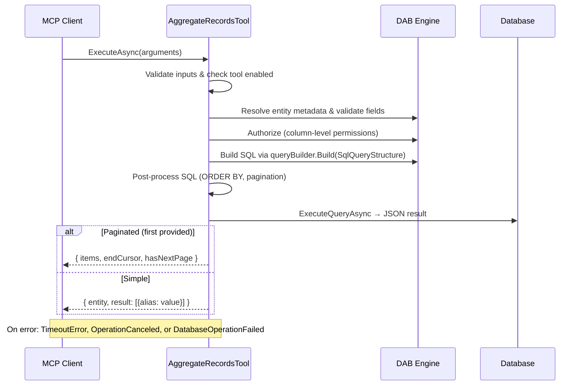

# AggregateRecordsTool

MCP tool that computes SQL-level aggregations (COUNT, AVG, SUM, MIN, MAX) on DAB entities. All aggregation is pushed to the database engine — no in-memory computation.

## Class Structure

| Member | Kind | Purpose |
|---|---|---|
| `ToolType` | Property | Returns `ToolType.BuiltIn` for reflection-based discovery. |
| `_validFunctions` | Static field | Allowlist of aggregation functions: count, avg, sum, min, max. |
| `GetToolMetadata()` | Method | Returns the MCP `Tool` descriptor (name, description, JSON input schema). |
| `ExecuteAsync()` | Method | Main entry point — validates input, resolves metadata, authorizes, builds the SQL query via the engine's `IQueryBuilder.Build(SqlQueryStructure)`, executes it, and formats the response. |
| `ComputeAlias()` | Static method | Produces the result column alias: `"count"` for count(\*), otherwise `"{function}_{field}"`. |
| `DecodeCursorOffset()` | Static method | Decodes a base64 opaque cursor string to an integer offset for OFFSET/FETCH pagination. Returns 0 on any invalid input. |
| `BuildPaginatedResponse()` | Private method | Formats a grouped result set into `{ items, endCursor, hasNextPage }` when `first` is provided. |
| `BuildSimpleResponse()` | Private method | Formats a scalar or grouped result set without pagination. |

## ExecuteAsync Sequence

## Key Design Decisions

- **No in-memory aggregation.** The engine's `GroupByMetadata` / `AggregationColumn` types drive SQL generation via `queryBuilder.Build(structure)`. All aggregation is performed by the database.
- **COUNT(\*) workaround.** The engine's `Build(AggregationColumn)` doesn't support `*` as a column name (it produces invalid SQL like `count([].[*])`), so the primary key column is used instead. `COUNT(pk)` ≡ `COUNT(*)` since PK is NOT NULL.
- **ORDER BY post-processing.** Neither the GraphQL nor REST code paths support ORDER BY on an aggregate expression, so this tool inserts `ORDER BY {func}({col}) ASC|DESC` into the generated SQL before `FOR JSON PATH`.
- **TOP vs OFFSET/FETCH.** SQL Server forbids both in the same query. When pagination (`first`) is used, `TOP N` is stripped via regex before appending `OFFSET/FETCH NEXT`.
- **Early field validation.** All user-supplied field names (aggregation field, groupby fields) are validated against the entity's metadata before authorization or query building, so typos surface immediately with actionable guidance.
- **Timeout vs cancellation.** `TimeoutException` (from `query-timeout` config) and `OperationCanceledException` (from client disconnect) are handled separately with distinct model-facing messages. Timeouts guide the model to narrow filters or paginate; cancellations suggest retry.
- **Database support.** Only MsSql / DWSQL — matches the engine's GraphQL aggregation support. PostgreSQL, MySQL, and CosmosDB return an `UnsupportedDatabase` error.
